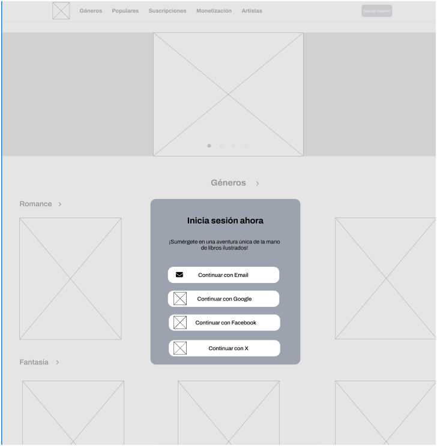
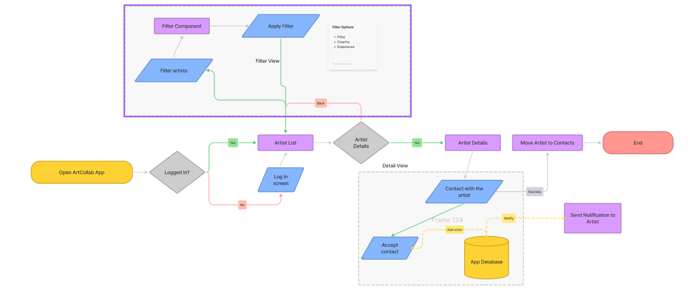

# COURSE PROJECT

    Universidad Peruana de Ciencias Aplicadas</> 
    </img> 
    Ingeniería de Software</> 
    Diseño de Experimentos de Ingeniería de Software</> 
    Profesor: Juan Carlos Tinoco</> 
     INFORME

    Startup: Artweb  </> 
    Producto:  </>

    <h3 align="center">Team Members:</h3>
    

     <table align="center">
        <tr>
            <th style="text-align:center;">Member</th>
            <th style="text-align:center;">Code</th>
        </tr>
        <tr>
            <td>Dam Rubianes, Frida Sofia</td>
            <td>U202218352</td>
        </tr>
        <tr>
            <td>Adrianzen Flores, Carlos Arturo</td>
            <td>U202215705</td>
        </tr>
        <tr>
            <td>Huarcaya Quispe, Niurka Lucero</td>
            <td>U20221B226</td>
        </tr>
        <tr>
            <td>More Rondon, Christopher Sebastian</td>
            <td>U202212199</td>
        </tr>
         
</table>

 

---

# Registro de Versiones del Informe

<table >
        <tr>
            <th style="text-align:center;">Versión</th>
            <th style="text-align:center;">Fecha</th>
            <th style="text-align:center;">Autor</th>
            <th style="text-align:center;">Descripción de la modificación</th>
        </tr>
        <tr>
            <td align = "center">TB1</td>
            <td>23/04/2025</td>
            <td>  

Dam Rubianes, Frida Sofia 

Adrianzen Flores, Carlos Arturo

3er integrante

4to integrante

</td>
            <td>Se agregó el contenido del capítulo 1, apartados 1.1, 1.2 y 1.3; el contenido del capítulo 2, apartados 2.1, 2.2, 2.3, 2.4; el contenido del capítulo 3, apartados 3.1, 3.2, 3.3 y 3.4; el contenido del capítulo 4, apartados 4.1, 4.2, 4.3, 4.4, 4.5, 4.6, 4.7 y 4.8; y el contenido del capítulo 5, apartados 5.1, 5.2, 5.3 y 5.4</td>
        <tr>
<tr>
            

<table>

 
  
---

# Contenido 
## Tabla de contenidos
### [Registro de versiones del informe](#registro-de-versiones-del-informe)
### [Student Outcome](#student-outcome)
## [Capítulo I: Introducción](#capítulo-i-introducción)
- [1.1. Startup Profile](#11-startup-profile)
  - [1.1.1. Descripción de la Startup](#111-descripción-de-la-startup)
  - [1.1.2. Perfiles de integrantes del equipo](#112-perfiles-de-integrantes-del-equipo)
- [1.2. Solution Profile](#12-solution-profile)
  - [1.2.1 Antecedentes y problemática](#121-antecedentes-y-problemática)
  - [1.2.2 Lean UX Process](#122-lean-ux-process)
    - [1.2.2.1. Lean UX Problem Statements](#1221-lean-ux-problem-statements)
    - [1.2.2.2. Lean UX Assumptions](#1222-lean-ux-assumptions)
    - [1.2.2.3. Lean UX Hypothesis Statements](#1223-lean-ux-hypothesis-statements)
    - [1.2.2.4. Lean UX Canvas](#1224-lean-ux-canvas)
- [1.3. Segmentos objetivo](#13-segmentos-objetivo)
## [Capítulo II: Requirements Elicitation & Analysis](#capítulo-ii-requirements-elicitation--analysis)
- [2.1. Competidores](#21-competidores)
  - [2.1.1. Análisis competitivo](#211-análisis-competitivo)
  - [2.1.2. Estrategias y tácticas frente a competidores](#212-estrategias-y-tácticas-frente-a-competidores)
- [2.2. Entrevistas](#22-entrevistas)
  - [2.2.1. Diseño de entrevistas](#221-diseño-de-entrevistas)
  - [2.2.2. Registro de entrevistas](#222-registro-de-entrevistas)
  - [2.2.3. Análisis de entrevistas](#223-análisis-de-entrevistas)
- [2.3. Needfinding](#23-needfinding)
  - [2.3.1. User Personas](#231-user-personas)
  - [2.3.2. User Task Matrix](#232-user-task-matrix)
  - [2.3.3. User Journey Mapping](#233-user-journey-mapping)
  - [2.3.4. Empathy Mapping](#234-empathy-mapping)
  - [2.3.5. As-is Scenario Mapping](#235-as-is-scenario-mapping)
- [2.4. Ubiquitous Language](#24-ubiquitous-language)
## [Capítulo III: Requirements Specification](#capítulo-iii-requirements-specification)
- [3.1. To-Be Scenario Mapping](#31-to-be-scenario-mapping)
- [3.2. User Stories](#32-user-stories)
- [3.3. Product Backlog](#33-product-backlog)
- [3.4. Impact Mapping](#34-impact-mapping)
## [Capítulo IV: Product Design](#capítulo-iv-product-design)
- [4.1. Style Guidelines](#41-style-guidelines)
  - [4.1.1. General Style Guidelines](#411-general-style-guidelines)
  - [4.1.2. Web Style Guidelines](#412-web-style-guidelines)
  - [4.1.3. Mobile Style Guidelines](#413-mobile-style-guidelines)
    - [4.1.3.1. iOS Mobile Style Guidelines](#4131-iOS-mobile-style-guidelines)
    - [4.1.3.2. Android Mobile Style Guidelines](#4132-android-mobile-style-guidelines)
- [4.2. Information Architecture](#42-information-architecture)
  - [4.2.1. Organization Systems](#421-organization-systems)
  - [4.2.2. Labeling Systems](#422-labeling-systems)
  - [4.2.3. SEO Tags and Meta Tags](#423-seo-tags-and-meta-tags)
  - [4.2.4. Searching Systems](#424-searching-systems)
  - [4.2.5. Navigation Systems](#425-navigation-systems)
- [4.3. Landing Page UI Design](#43-landing-page-ui-design)
  - [4.3.1. Landing Page Wireframe](#431-landing-page-wireframe)
  - [4.3.2. Landing Page Mock-up](#432-landing-page-mock-up.
- [4.4. Mobile Applications UX/UI Design](#44-mobile-applications-uxui-design)
  - [4.4.1. Mobile Applications Wireframes](#441-mobile-applications-wireframes)
  - [4.4.2. Mobile Applications Wireflow Diagrams](#442-mobile-applications-wireflow-diagrams)
  - [4.4.3. Mobile Applications Mock-ups](#443-mobile-applications-mock-ups)
  - [4.4.4. Mobile Applications User Flow Diagrams](#444-mobile-applications-user-flow-diagrams)
- [4.5. Mobile Applications Prototyping](#45-web-applications-prototyping)
  - [4.5.1. Android Mobile Applications Prototyping](#451-andorid-web-applications-prototyping)
  - [4.5.2. iOS Mobile Applications Prototyping](#452-iOS-web-applications-prototyping)
- [4.6. Web Applications UX/UI Design](#46-web-applications-uxui-design)
  - [4.6.1. Web Applications Wireframes](#461-web-applications-wireframes)
  - [4.6.2. Web Applications Wireflow Diagrams](#462-web-applications-wireflow-diagrams)
  - [4.6.3. Web Applications Mock-ups](#463-web-applications-mock-ups)
  - [4.6.4. Web Applications User Flow Diagrams](#464-web-applications-user-flow-diagrams)
- [4.7. Web Applications Prototyping](#47-web-applications-prototyping
- [4.8. Domain-Driven Software Architecture](#48-domain-driven-software-architecture)
  - [4.8.1. Software Architecture Context Diagram](#481-software-architecture-context-diagram)
  - [4.8.2. Software Architecture Container Diagrams](#482-software-architecture-container-diagrams)
  - [4.8.3. Software Architecture Components Diagrams](#483-software-architecture-components-diagrams)
- [4.9. Software Object-Oriented Design](#49-software-object-oriented-design)
  - [4.9.1. Class Diagrams](#491-class-diagrams)
  - [4.9.2. Class Dictionary](#492-class-dictionary)
- [4.10. Database Design](#410-database-design)
  - [4.10.1. Relational/Non-Relational Database Diagram](#4101-relational/ron-Relational-database-diagram)
## [Capítulo V: Product Implementation, Validation & Deployment](#capítulo-v-product-implementation-validation--deployment)
- [5.1. Software Configuration Management](#51-software-configuration-management)
  - [5.1.1. Software Development Environment Configuration](#511-software-development-environment-configuration)
  - [5.1.2. Source Code Management](#512-source-code-management)
  - [5.1.3. Source Code Style Guide & Conventions](#513-source-code-style-guide--conventions)
  - [5.1.4. Software Deployment Configuration](#514-software-deployment-configuration)
- [5.2. Product Implementation & Deployment](#52-product-implementation--deployment)
  - [5.2.1. Sprint Backlogs](#521-sprint-backlogs)
  - [5.2.2. Implemented Landing Page Evidence](#522-implemented-landing-page-evidence)
  - [5.2.3. Implemented Frontend-Web Application Evidence](#523-implemented-frontend-web-application-evidence)
  - [5.2.4. Implemented Native-Mobile Application Evidence](#524-implemented-native-mobile-application-evidence)
  - [5.2.5. Implemented RESTful API and/or Serverless Backend Evidence](#525-implemented-restful-api-andor-serverless-backend-evidence)
  - [5.2.6. RESTful API Documentation](#526-restful-api-documentation)
  - [5.2.7. Team Collaboration Insights](#527-team-collaboration-insights)
- [5.3. Video About-the-Product](#53-video-about-the-product)
## [Capítulo VI: Product Verification & Validation](#capítulo-vi-product-verification-&-validation)
- [6.1. Testing Suites & Validation](#61-testing-suites-&-validation)
  - [6.1.1. Core Entities Unit Tests](#611-core-entities-unit-tests)
  - [6.1.2. Core Integration Tests](#612-core-integration-tests)
  - [6.1.3. Core Behavior-Driven Development](#613-core-brhavior-driven-development)
  - [6.1.4. Core System Tests](#614-core-system-tests)
## [Capítulo VII: DevOps Practices](#capítulo-vii-devops-practices)
- [7.1. Continuos Integration](#71-continuos-integration)
  - [7.1.1. Tools and Practices](#711-tools-and-practices)
  - [7.1.2. Build & Test Suite Pipeline Components](#711-build-&-test-suite-pipeline-components)
- [7.2. Continuos Delivery](#72-continuos-delivery)
  - [7.2.1. Tools and Practices](#721-tools-and-practices)
  - [7.2.2. Stage Deployment Pipeline Components](#721-stage-deployment-pipeline-components)
- [7.3. Continuos Deployment](#73-continuos-deployment)
  - [7.2.1. Tools and Practices](#731-tools-and-practices)
  - [7.2.2. Production Deployment Pipeline Components](#731-production-deployment-pipeline-components)

- [Avance de Conclusiones, Bibliografía y Anexos](#avance-de-conclusiones-bibliografía-y-anexos)

## Student Outcome
<table>
    <tr>
        <td>Criterio especifico</td>
        <td>Acciones realizadas</td>
        <td>Conclusiones</td>
    </tr>
    <tr>
        <td>4.c.1 Reconoce responsabilidad ética y profesional en situaciones de ingenieria de software</td>
        <td>
            TB1:  
            Christopher Sebastian More Rondon: En esta entrega fui el encargado de selecciona las user stories para nuestro producto junto con su product backlog, asi como de especificar 
            las desiciones de estilo para la aplicación en moviles, con el obejtivo de darle una buena experiencia al usuario 
            Carlos Arturo Adrianzen Flores: En esta entrega fui el encargado de la seccio del analisis competitivo y las entrevistas, ademas de la realizacion de las UX/UI diagrams correspondientes 
            Niurka Lucero Huarcaya Quispe: En esta entrega, elaboré los diagramas de arquitectura que documentan de manera clara y estructurada el funcionamiento del sistema. Además, desarrollé el Sprint Backlog, de manera que la trazabilidad y el cumplimiento de buenas prácticas estén en el proceso de desarrollo. 
            Frida Sofia Dam Rubianes: En esta entrega, participé en la definición de criterios de calidad y validación para las funcionalidades del sistema, asegurándome de que cumplan con los principios éticos y profesionales de la ingeniería de software. Además, colaboré en la revisión de los entregables del equipo para garantizar que reflejen buenas prácticas de desarrollo y un compromiso real con la responsabilidad hacia los usuarios finales. 
        </td>
        <td>
            TB1: Se consideraron las necesidades de los usuarios en todas las fases del desarrollo, desde el diseño de la solución hasta la implementación y el impacto de las decisiones tomadas para la plataforma.
        </td>
    </tr>
    <tr>
        <td>4.c.2 Emite juicios informados considerando el impacto de las soluciones de Ingenieria de software en contextos globales, económicos, ambientales y sociales</td>
        <td>
            TB1:  
            Christopher Sebastian More Rondon: Me encargue de crear las user stories, asegurandome de que sean objetivos necesarios para que nuestra aplicación cumpla con los requerimientos
            de los usuario 
            Carlos Arturo Adrianzen Flores: Al momento de realizar partes del informe como los diagramas, tuve en cuenta el impacto de las soluciones a nivel global, y como nuestra propia solucion podria llegar a tener dicho impacto. 
            Niurka Lucero Huarcaya Quispe: Me hice cargo de crear diagramas de arquitectura que detallan cómo el sistema interactúa con su entorno y distribuye funcionalidades, lo que me permite evaluar su impacto global, económico, social y ambiental. Además, al gestionar el Sprint Backlog, se priorizaron las tareas teniendo en cuenta estas dimensiones. 
            Frida Sofia Dam Rubianes: En esta entrega, analicé los posibles efectos de nuestra solución en diferentes contextos, enfocándome en cómo el diseño y las funcionalidades propuestas podrían influir en la accesibilidad y sostenibilidad del producto. Asimismo, aporté en la planificación de tareas, priorizando aquellas que maximicen el valor social y económico para los usuarios, sin comprometer la responsabilidad ambiental. .. 
        </td>
        <td>
            TB1: Se tomaron decisiones conscientes durante el proceso de diseño y desarrollo del producto, considerando cómo nuestras soluciones tecnológicas afectan a las comunidades. Además, en cada etapa, se priorizaron enfoques sostenibles y responsables.
        </td>
    </tr>
</table>
  
---

## Capítulo I: Introducción
### 1.1. Startup Profile
#### 1.1.1. Descripción de la Startup
**Artweb** es una startup que busca revolucionar el ecosistema digital de obras literarias ilustradas, un sector creativo y culturalmente valioso que ha sido poco atendido por las plataformas actuales. Nuestra propuesta se enfoca en impulsar el arte visual-narrativo a través de soluciones tecnológicas innovadoras que mejoren su difusión, accesibilidad y reconocimiento en el entorno digital.

Nos caracterizamos por integrar innovación, construcción de comunidad y sostenibilidad, ofreciendo a ilustradores y creadores un espacio justo para publicar, compartir y monetizar sus obras. Mediante herramientas digitales accesibles, estrategias de promoción efectivas y entornos de colaboración, aspiramos a posicionarnos como la principal plataforma en Perú y, posteriormente, en toda Latinoamérica, transformando la forma en que las historias ilustradas son compartidas y valoradas en el mundo digital.

## Misión
Potenciar la visibilidad y el crecimiento de artistas visuales a través de una plataforma digital especializada que facilite la publicación y monetización de obras ilustradas, promoviendo a su vez el acceso a contenidos narrativos en formatos innovadores como libros ilustrados y cómics.

## Visión
Ser reconocidos como la plataforma líder en Latinoamérica —con enfoque inicial en el mercado peruano— para la promoción de obras ilustradas, desarrollando soluciones tecnológicas que transformen la manera en que las historias visuales y literarias son compartidas, consumidas y apreciadas en el entorno digital.

#### 1.1.2. Perfiles de integrantes del equipo
<table border="1" width="70%" style="text-align:center;">
    <tr align="center">
        <td rowspan="3">
            
        </td>
        <td align="left">
            <b>Nombre y Apellido:</b>
                         
            Frida Sofia Dam Rubianes 
        </td>
    </tr>
    <tr>
        <td align="left">
            <b>Carrera:</b>
             
            Ingeniería de Software.
        </td>
    </tr>
    <tr>
        <td align="left">
            <b>Acerca de:</b>
             
            Me apasiona aprender nuevos lenguajes de programación y trabajar en equipo. Actualmente domino C++ y estoy estudiando Python, C# y Java. Además, me caracterizo por ser responsable, participativa y empática.
        </td>
    </tr>
    <tr align="center">
        <td rowspan="3">
            
        </td>
        <td align="left">
            <b>Nombre y Apellido:</b>
                         
            Carlos Arturo Adrianzen Flores
        </td>
    </tr>
    <tr>
        <td align="left">
            <b>Carrera:</b>
             
            Ingeniería de Software.
        </td>
    </tr>
    <tr>
        <td align="left">
            <b>Acerca de:</b>
             
            Me interesa el análisis de datos, el desarrollo de software y siempre estoy buscando maneras de mejorar y aprender cosas nuevas.
        </td>
    </tr>
    <tr align="center">
         <td rowspan="3">
             
         </td>
         <td align="left">
             <b>Nombre y Apellido:</b>
                          
             Niurka Lucero Huarcaya Quispe
         </td>
     </tr>
     <tr>
         <td align="left">
             <b>Carrera:</b>
              
             Ingeniería de Software.
         </td>
     </tr>
     <tr>
         <td align="left">
             <b>Acerca de:</b>
              
             Considero que soy una persona responsable y que puedo aportar al equipo en cualquier aspecto que se requiera con los conocimientos que he ido adquiriendo en ciclos anteriores.
         </td>
</tr>
    <tr align="center">
        <td rowspan="3">
            
        </td>
        <td align="left">
            <b>Nombre y Apellido:</b>
                         
            Christopher Sebastian More Rondon 
        </td>
    </tr>
    <tr>
        <td align="left">
            <b>Carrera:</b>
             
            Ingeniería de Software.
        </td>
    </tr>
    <tr>
        <td align="left">
            <b>Acerca de:</b>
             
            Soy un estudiante creativo y responsable, con conocimientos en C#, Phyton y HTML, siempre me esfuerzo por entregar un trabajo que satisfaga a los clientes
        </td>
    </tr>
</table>

### 1.2. Solution Profile
# ArtCollab

**ArtCollab** es una plataforma web enfocada en la publicación, lectura y promoción de libros ilustrados en formato digital. Su propósito es ofrecer un espacio exclusivo para obras que fusionan narrativa y arte visual, un segmento que hasta ahora no había logrado una presencia sólida en el ámbito digital. La plataforma proporciona experiencias de lectura interactivas y de alta calidad, además de herramientas que permiten a autores e ilustradores publicar, monetizar y difundir sus creaciones a nivel global.

## Características Principales

Uno de los grandes diferenciales de **ArtCollab** es su sistema de conexión creativa: ilustradores y escritores pueden encontrar colaboradores compatibles basándose en intereses, estilos artísticos o proyectos específicos. Esta funcionalidad incluye:

- Perfiles profesionales detallados
- Portafolios integrados
- Canales de comunicación interna

Todo esto facilita la formación de equipos de trabajo, fomentando una colaboración ágil y efectiva. Tanto ilustradores como escritores pueden generar ingresos a partir de sus publicaciones, apoyando así la producción artística y promoviendo su sostenibilidad económica.

#### 1.2.1. Antecedentes y problemática

La transformación digital ha renovado el interés por la lectura, especialmente entre el público joven, que ha migrado a plataformas como Wattpad para encontrar historias que resuenan con sus emociones y vivencias. Con más de 70 millones de lectores activos al mes y más de 565 millones de obras compartidas, este fenómeno confirma que la pasión por leer sigue vigente (Incertis, 2023). Sin embargo, este crecimiento no ha sido equitativo: los libros ilustrados —que combinan el arte visual con la narrativa escrita— continúan siendo un formato relegado en el ámbito digital, careciendo de plataformas que realmente los impulsen y les otorguen la visibilidad que merecen.

Al mismo tiempo, los creadores visuales enfrentan importantes desafíos para obtener reconocimiento y condiciones laborales justas. La controversia alrededor de la campaña de Webtoon, que minimizó el trabajo de los ilustradores al llamarlo un “side-hustle”, generó un fuerte rechazo en la comunidad creativa bajo el hashtag #notasidehustle, destacando la dedicación extrema que implica crear contenido visual de calidad —superando, en muchos casos, las 80 horas de trabajo semanal (Codega, 2022). Esta problemática se agrava en mercados como el asiático, donde casos como el del joven ilustrador de “Solo Leveling”, quien falleció tras jornadas extenuantes que exigían la producción de más de 100 viñetas semanales, evidencian un entorno laboral insostenible (Han-sol, 2022). Estos sucesos reflejan una industria que, a pesar de su éxito, aún no proporciona las garantías necesarias para sus artistas.

Dentro de este panorama, **ArtCollab** surge como una respuesta integral que no solo impulsa la lectura de obras ilustradas, sino que también crea un ecosistema que apoya y dignifica a los creadores visuales. Nuestra plataforma facilita la colaboración entre escritores e ilustradores, permitiéndoles desarrollar libros digitales en conjunto, además de ofrecer herramientas específicas para la publicación, promoción y monetización de sus proyectos. A través de mecanismos de distribución de ingresos justos, espacios de visibilidad y una comunidad activa y solidaria, buscamos transformar el ecosistema digital, valorizando tanto el arte gráfico como la narrativa, y ofreciendo una alternativa sostenible y enfocada en la dignidad de los artistas.

En este contexto, como equipo, emplearemos la metodología de las **5Ws & 2Hs** para describir de forma precisa y detallada los antecedentes y las problemáticas identificadas.

## What (¿Qué es?)

ArtCollab es una plataforma digital interactiva diseñada para facilitar la colaboración entre escritores e ilustradores en la creación de libros ilustrados digitales. Su propuesta de valor se centra en ofrecer un entorno especializado donde ambos perfiles puedan encontrarse, trabajar juntos, publicar sus obras y acceder a ingresos equitativos por su contenido. Es la primera aplicación enfocada exclusivamente en potenciar el desarrollo de libros ilustrados a través de la co-creación, un segmento que hasta ahora ha sido desatendido en el mercado editorial digital.

## Why (¿Por qué?)

ArtCollab nace como respuesta a dos desafíos fundamentales: la falta de plataformas que apoyen el desarrollo de proyectos de libros ilustrados de manera colaborativa, y la precarización del trabajo creativo, en especial el de los ilustradores. A pesar de la alta demanda de contenido visual y narrativo, quienes crean estas obras enfrentan dificultades para obtener visibilidad y retribución justa. Situaciones como la controversia generada por la campaña de Webtoon (#notasidehustle) o la tragedia de artistas en Asia sometidos a cargas laborales extremas (Han-sol, 2022; Codega, 2022; Incertis, 2023) demuestran la necesidad urgente de crear entornos colaborativos más dignos y sostenibles para los creadores.

## Who (¿Para quién es?)

La plataforma está dirigida a escritores e ilustradores que deseen desarrollar obras ilustradas digitales, ya sea de forma independiente o en colaboración. ArtCollab busca integrar tanto a creadores emergentes como a profesionales consolidados, fomentando la conexión de talentos y la experimentación conjunta de nuevas formas narrativas. El objetivo es reunir a aquellos interesados en explorar y consolidar proyectos que integren arte visual y texto de manera innovadora, contribuyendo así al crecimiento profesional y creativo de ambos segmentos.

## Where (¿Dónde?)

El lanzamiento inicial de ArtCollab se llevará a cabo en Perú, con la proyección de expandirse posteriormente hacia Latinoamérica, una región rica en talento creativo pero con poca representación en iniciativas digitales de este tipo. Gracias a su naturaleza digital, la plataforma será accesible globalmente desde cualquier dispositivo conectado a internet, permitiendo a los escritores e ilustradores expandir sus oportunidades creativas y profesionales más allá de sus fronteras locales.

## When (¿Cuándo?)

ArtCollab está diseñada para ser lanzada en el corto plazo, en un contexto de transformación del mercado editorial digital y de creciente conciencia sobre la necesidad de espacios de colaboración más éticos. La tendencia actual hacia modelos de trabajo creativo más inclusivos y sostenibles hace que el momento sea ideal para introducir esta plataforma, adaptándose a las dinámicas emergentes de co-creación y publicación digital.

## How (¿Cómo funciona?)

La plataforma opera como un ecosistema que conecta escritores e ilustradores de manera fluida:

- Los escritores pueden subir sus conceptos, sinopsis o borradores de historias.
- Los ilustradores pueden postularse para ilustrar estos proyectos o proponer estilos visuales compatibles.
- ArtCollab facilita la formación de equipos creativos mediante herramientas de comunicación interna y gestión de proyectos.
- Se ofrecen opciones para publicar las obras terminadas, establecer acuerdos de monetización conjunta, promocionar los proyectos y construir portafolios digitales para ambos creadores.

## How much (¿Cuánto cuesta?)

El modelo de ingresos de ArtCollab contempla diversas fuentes:

- Suscripciones premium para escritores e ilustradores que deseen acceder a herramientas exclusivas, mayor visibilidad y servicios personalizados.
- Publicidad dirigida, enfocada en creadores y marcas relacionadas con el arte y la cultura.
- En el mediano plazo, se proyectan alianzas estratégicas con editoriales y marcas culturales que permitan ampliar el alcance y las oportunidades de monetización para los usuarios.

#### 1.2.2. Lean UX Process
##### 1.2.2.1. Lean UX Problem Statements
## Domain

ArtCollab se sitúa en la intersección de la industria editorial digital y las plataformas de creación colaborativa, enfocándose específicamente en el nicho de los libros ilustrados. Este segmento combina narrativa literaria con arte visual, pero ha sido ampliamente ignorado por plataformas populares de autopublicación o lectura digital, que priorizan obras textuales o cómics serializados.

## Customer Segments

- **Ilustradores / Artistas Visuales Digitales:**
  - Profesionales o aspirantes que buscan visibilidad, oportunidades de colaboración, monetización justa y construcción de portafolio.

- **Escritores / Narradores Digitales:**
  - Autores interesados en enriquecer sus historias con ilustraciones, encontrar colaboradores artísticos y compartir su obra con una audiencia global.

## Pain Points

- **Ilustradores / Artistas Visuales Digitales:**
  - Falta de plataformas que valoren su trabajo como actividad profesional, no como "pasatiempo".
  - Ausencia de oportunidades sostenibles para monetizar su arte en libros.
  - Invisibilidad en plataformas centradas solo en texto o cómic serializado.

- **Escritores / Narradores Digitales:**
  - Dificultad para encontrar colaboradores visuales confiables y con estilos adecuados.
  - Limitaciones técnicas o económicas para autopublicar libros ilustrados.
  - Falta de espacios para diferenciarse en un mercado saturado de narrativa textual.

## Gap

No existe actualmente una plataforma integral que:
- Se enfoque exclusivamente en libros ilustrados digitales.
- Facilite activamente la conexión entre escritores e ilustradores.
- Ofrezca herramientas de publicación, monetización y promoción adaptadas a la colaboración interdisciplinaria.
- Garantice condiciones dignas, transparentes y sostenibles para creadores independientes.

## Vision / Strategy

- **Visión:**  
  Convertirse en el ecosistema líder en creación, difusión y monetización de libros ilustrados digitales en Latinoamérica, ofreciendo una experiencia colaborativa, justa y creativa para artistas y narradores.

- **Estrategia:**  
  - Crear una plataforma web con funcionalidades enfocadas en el trabajo colaborativo entre escritor e ilustrador.
  - Establecer un modelo de monetización justo y transparente.
  - Fomentar comunidad, portafolio, visibilidad y herramientas de crecimiento profesional.
  - Iniciar con el mercado peruano y escalar a nivel regional y global.

## Initial Segment

- Ilustradores digitales jóvenes que buscan visibilidad y oportunidades reales de colaboración y monetización.
- Escritores independientes que desean publicar libros ilustrados sin depender de editoriales tradicionales.

##### 1.2.2.2. Lean UX Assumptions
# Business Assumptions

- La creciente producción de contenido visual y narrativo en plataformas digitales evidencia la necesidad de espacios más especializados y colaborativos.
- Existe una comunidad activa de ilustradores y escritores que buscan nuevas formas de visibilidad, colaboración y monetización.
- La auto-publicación y los modelos de economía colaborativa están en aumento, lo que favorece iniciativas como **ArtCollab**.
- El actual ecosistema de plataformas (Instagram, Wattpad, Behance) no resuelve completamente la necesidad de colaboración directa y co-creación entre artistas visuales y escritores.
- Artistas y escritores están dispuestos a migrar a una nueva plataforma si se les garantiza una comunidad activa, oportunidades reales de colaboración y beneficios económicos.
- Las universidades, colectivos artísticos y escuelas creativas podrían convertirse en aliados estratégicos para promover la adopción.
- El modelo **freemium** con funcionalidades premium para monetización, promoción o visibilidad aumentada es viable en este nicho.
- La narrativa ilustrada está creciendo en formatos digitales como cómics, libros infantiles y novelas gráficas, representando una oportunidad de negocio creciente.

# Business Outcomes

- Generar una comunidad sólida de ilustradores y escritores activos en la plataforma en los primeros **6 meses** (**1000+ usuarios**).
- Facilitar la creación de al menos **500 proyectos colaborativos** en el primer año.
- Monetizar los primeros **100 libros ilustrados** a través de modelos como suscripciones, descargas pagas o crowdfunding.
- Posicionar a **ArtCollab** como referente en plataformas de co-creación artística digital en el mundo hispano.
- Establecer **alianzas con al menos 10 instituciones educativas o culturales** en el primer año.
- Obtener feedback de calidad para iterar la plataforma en sus primeras fases **MVP**.

# User Assumptions

### ¿Quién es el usuario?
- **Ilustradores y artistas visuales** (18-35 años) interesados en libros ilustrados, cómic, narrativa gráfica, etc.
- **Escritores independientes** (18-40 años) que desean transformar sus textos en experiencias visuales colaborativas.

### ¿Qué problemas resuelve nuestro producto?
- Falta de plataformas que fomenten la colaboración creativa entre artistas y escritores.
- Dificultad para encontrar perfiles complementarios para proyectos (**ilustradores o escritores**).
- Baja visibilidad y escasa monetización de obras ilustradas fuera de redes sociales.
- Fragmentación de procesos: creación, edición, publicación y difusión están en espacios distintos.

### ¿Qué características son importantes?
- Espacios de **conexión y networking** entre ilustradores y escritores.
- **Sistema de publicación digital** de libros ilustrados.
- Herramientas de **monetización** (suscripciones, propinas).
- **Perfiles profesionales** con portafolio y muestra de obras.
- **Buscador de talentos** con filtros por estilo, género, ubicación y experiencia.
- **Sistema de seguimiento y feedback colaborativo**.

### ¿Dónde encaja nuestro producto en su trabajo o vida?
- En la **fase de creación, publicación y promoción** de obras narrativas ilustradas.
- Como **medio para encontrar socios creativos**.
- Como **canal para publicar y visibilizar** su trabajo profesional.

### ¿Cuándo y cómo es usado nuestro producto?
- En **sesiones creativas colaborativas** (a través de chats, intercambios de archivos y herramientas editoriales).
- Durante el **proceso de publicación y difusión** de sus obras ilustradas.
- Como **portafolio** para mostrar sus proyectos en redes o a potenciales clientes/editoriales.

### ¿Cómo debe verse nuestro producto y cómo debe comportarse?
- **Diseño Limpio y Atractivo**: Interfaz intuitiva con un enfoque en las ilustraciones.
- **Facilidad de Uso**: Navegación sencilla y procesos claros para cargar contenido.
- **Comunidad y Colaboración**: Fomentar la interacción entre usuarios.
- **Transparencia en Compensación**: Información clara sobre cómo se remunera a los artistas.

# User Outcomes

- **Mayor exposición y visibilidad** para ilustradores y escritores en una comunidad creativa especializada.
- **Aumento de oportunidades reales de colaboración** para proyectos ilustrados.
- **Acceso a nuevas fuentes de ingresos** por sus obras.
- **Mayor motivación y continuidad en proyectos creativos** gracias a un entorno colaborativo.
- **Profesionalización del portafolio y del trabajo artístico-literario**.
- **Ahorro de tiempo** en la búsqueda de colaboradores o en la gestión de publicación y difusión.
- **Satisfacción** al formar parte de una comunidad que reconoce y promueve el arte colaborativo.
- **Incremento en la cantidad de obras ilustradas** publicadas y compartidas.

# Features Assumptions

- La herramienta de **publicación será sencilla**, intuitiva y permitirá la personalización estética del libro digital.
- La plataforma permitirá **integrar imágenes y textos** de forma fluida y visualmente atractiva.
- El **sistema de monetización será transparente y justo**, sin comisiones abusivas.
- Los usuarios podrán acceder desde **distintos dispositivos** y navegar sin fricciones.
- El contenido podrá **compartirse fácilmente en redes sociales** o con terceros para ampliar visibilidad.
- El crecimiento inicial se basará en **círculos de confianza y comunidades creativas existentes**.

##### 1.2.2.3. Lean UX Hypothesis Statements
Creemos que al simplificar el proceso de registro y permitir acceso mediante redes sociales o correo, aumentaremos la tasa de conversión de escritores e ilustradores nuevos. Sabremos que hemos tenido éxito cuando el número de cuentas nuevas creadas en los primeros 7 días post-lanzamiento aumente al menos un 30% respecto al promedio actual.

Creemos que al implementar una función de mensajería entre escritores e ilustradores, mejoraremos la fluidez de colaboración y la creación conjunta de proyectos. Sabremos que hemos tenido éxito cuando aumente en un 25% la creación de proyectos colaborativos y mejore la retención mensual de usuarios activos en un 15%.

Creemos que al proporcionar métricas claras y visuales sobre visualizaciones, comentarios y ventas, motivamos a los creadores a continuar publicando contenido. Sabremos que hemos tenido éxito cuando haya un incremento en la frecuencia de publicaciones por usuario y se observe una mayor satisfacción según encuestas o feedback.

Creemos que al ofrecer una suscripción premium con beneficios exclusivos (visibilidad, promoción, acceso prioritario a ilustradores/escritores), aumentaremos la retención y generamos ingresos sostenibles. Sabremos que hemos tenido éxito cuando al menos un 15% de usuarios activos se suscriban al plan premium y se incremente su tiempo promedio de permanencia.

Creemos que al integrar una función para que los creadores se den retroalimentación entre ellos, mejoraremos la calidad de los proyectos y fortaleceremos la comunidad creativa. Sabremos que hemos tenido éxito cuando al menos el 40% de los proyectos reciban comentarios útiles dentro de los 5 primeros días de publicación y mejore la percepción de valor en la comunidad.

##### 1.2.2.4. Lean UX Canvas
<TABLE BORDER>
	<TR>
		<TD ROWSPAN=2>

**Lean UX Canvas**
</TD>
	    	<TD ROWSPAN=2></TD> <TD>

**Fecha:** 23/04/2025

</TD> 
	</TR>
	<TR>
		<TD>

**Iteración 1**
</TD> 
	</TR>
    <TR>
		<TD ROWSPAN>
        
**1. Problema de negocios:**
        
En la actualidad, no hay una plataforma digital que integre y fomente la colaboración entre escritores e ilustradores dedicados a los libros ilustrados digitales. Las opciones actuales, como Wattpad y Webtoon, no cubren de manera adecuada las necesidades de cooperación creativa, remuneración equitativa, visibilidad y lealtad. También, la calidad del contenido y la retención de los usuarios siguen siendo retos importantes para asegurar el éxito duradero de estas plataformas.

</TD>
	    	<TD ROWSPAN=2>

**5. Ideas de solución:**
- **Herramientas de colaboración:** Mensajería directa, gestión de hitos y notificaciones.

- **Sistema de monetización transparente:** Ingresos compartidos, suscripciones premium, ventas individuales.

- **Perfiles de usuario creativos:** Portafolios visuales, historial de proyectos, valoraciones.

- **Métricas y analíticas:** Visualizaciones, comentarios, ventas y feedback.

- **Mercado de talentos:** Búsqueda de perfiles compatibles para iniciar colaboraciones.

- **Desafíos creativos:** Retos semanales temáticos para incentivar la producción colaborativa.

- **Validación social:** Comentarios entre creadores y sistema de likes.

- **Compatibilidad multidispositivo:** Acceso desde distintos equipos con sincronización.

</TD> <TD ROWSPAN=2>

**2. Resultados comerciales:**

- **Aumento mensual** en el número de cuentas nuevas y usuarios activos.
- **Incremento** de proyectos colaborativos publicados exitosamente.
- **Alta tasa de retención** y participación recurrente de los creadores.
- **Crecimiento sostenible** de ingresos a través de planes premium.
- **Reconocimiento** de ArtCollab como un referente en el sector creativo digital.

</TD> 
	</TR>
	<TR>
		<TD >
        
**3. Usuarios y Clientes:**

- **Ilustradores:** Buscan visibilidad, oportunidades de colaboración, ingresos y reconocimiento.
- **Escritores:** Necesitan apoyo visual para sus historias, acceso a talento artístico y herramientas para publicación y monetización.

</TD> 
	</TR>
    <TR>
		<TD ROWSPAN=2>

**6. Hipótesis**
        
Creemos que al simplificar el proceso de registro en nuestra plataforma, aumentaremos la tasa de conversión de nuevos usuarios. Sabremos que hemos tenido éxito cuando observamos un aumento significativo en el número de cuentas creadas en los primeros 7 días después del lanzamiento.

Creemos que al implementar una función de mensajería entre escritores e ilustradores, mejoraremos la colaboración creativa en nuestra plataforma. Sabremos que hemos tenido éxito cuando veamos un aumento en la cantidad de proyectos colaborativos publicados y una mayor retención de usuarios.

Creemos que al ofrecer una sección destacada para los “Mejores Libros Ilustrados de la Semana”, aumentaremos la participación de los lectores. Sabremos que hemos tenido éxito cuando observamos un aumento en las visitas a esta sección y una mayor interacción con las obras destacadas.

Creemos que al proporcionar métricas claras sobre las visualizaciones y las ventas de libros, motivamos a los escritores e ilustradores a seguir creando contenido. Sabremos que hemos tenido éxito cuando veamos un aumento en la producción de libros digitales ilustrados y una mayor satisfacción de los creadores.

Creemos que al incorporar un sistema de suscripción premium para escritores e ilustradores, aumentaremos la retención de usuarios y generamos ingresos sostenibles. Sabremos que hemos tenido éxito cuando observamos un aumento en las suscripciones premium y una mayor participación activa de los creadores.
</TD>

<TD ROWSPAN=2>

**7. ¿Qué es lo más importante que debemos aprender primero?**

Quiénes son nuestros usuarios ideales y qué buscan realmente en términos de colaboración y visibilidad.

Cómo se comportan en plataformas similares, qué les frustra, qué valoran y qué funcionalidades son imprescindibles.

Qué tipo de monetización resulta atractiva y viable para ambos perfiles (escritor e ilustrador).

Qué necesidades no están cubiertas actualmente por la competencia.
</TD> 

<TD>

**4. Beneficios del usuario:**

**Ilustradores:**

- Mayor exposición y portafolio digital centralizado.
- Conexiones directas con escritores.
- Posibilidad de ingresos por colaboraciones y ventas.

**Escritores:**

- Mejora visual de sus obras gracias a la colaboración con ilustradores.
- Acceso rápido y confiable a talento artístico.
- Ingreso mediante ventas o suscripciones premium.
</TD> 
	</TR>
	<TR>
		<TD>
        
**8. ¿Cuál es la menor cantidad de trabajo que necesitamos para resolver las dudas y para hacer lo siguiente más importante?**

- Soporte al Usuario:

Responder rápidamente a las preguntas y consultas de los usuarios. Esto garantiza una buena experiencia y retención de usuarios.
- Investigación de Competidores:

Realizar un análisis rápido de las aplicaciones similares en el mercado. Esto nos ayudará a comprender las mejores prácticas y las oportunidades de mejora.
- Validación de Idea:

Crear prototipos o pruebas de concepto para validar nuestra idea antes de invertir en un desarrollo completo.
- Plan de Marketing Básico:

Diseñar un plan de marketing simple para promocionar la aplicación. Esto puede incluir estrategias de redes sociales y relaciones públicas.
</TD> 
	</TR>
</TABLE>

### 1.3. Segmentos objetivo

Esta sección presenta la descripción de los segmentos relacionados con el dominio del problema, considerando características geográficas y demográficas. Con el propósito de diseñar un producto alineado a las necesidades de los usuarios, ArtCollab centrará su enfoque en los siguientes grupos:

Ilustradores digitales en busca de visibilidad y colaboración creativa:  
ArtCollab servirá como un espacio para que ilustradores exhiban su portafolio, trabajen junto a escritores y generen ingresos mediante proyectos de libros ilustrados digitales.

**Características demográficas:** Personas de 18 a 40 años con habilidades en ilustración digital, apasionados por el arte, la narrativa visual y la creación gráfica. Generalmente poseen experiencia en diseño, uso de herramientas gráficas y manejo de redes sociales.

**Características geográficas:** Principalmente ubicados en países hispanohablantes (como Perú, México, Colombia y Argentina), aunque con oportunidades de expansión global dada la naturaleza digital de la plataforma.

Escritores que buscan enriquecer y publicar sus historias con ilustraciones:  
ArtCollab permitirá a los escritores crear y difundir obras ilustradas, encontrar ilustradores que potencien visualmente sus textos y obtener ingresos a partir de sus contenidos.

**Características demográficas:** Personas de 18 a 45 años interesadas en la escritura creativa, especialmente en narrativa, cuentos ilustrados, cómics o literatura infantil. Muchos de ellos buscan mayor visibilidad, colaboración artística y un entorno de crecimiento profesional.

**Características geográficas:** Provenientes de países de habla hispana, con acceso a dispositivos móviles o computadoras e internet. El mercado inicial estará enfocado en América Latina, especialmente en Perú.

## Capítulo II: Requirements Elicitation & Analysis
### 2.1. Competidores
Tras realizar un análisis de mercado, hemos identificado tres plataformas principales que ofrecen servicios similares a los que ArtCollab propone, enfocados en conectar ilustradores con escritores. Estas plataformas son: Wattpad, Webtoon y Tapas. A continuación, se describen sus principales características:

**Wattpad:**

Wattpad es una plataforma muy popular que permite a los usuarios escribir, publicar y leer historias de manera gratuita o a través de micropagos y suscripciones. Es especialmente conocida entre jóvenes aficionados a la escritura, contando con una comunidad activa y diversidad de géneros. Aunque facilita la exposición de nuevos talentos, su enfoque está centrado en la narrativa escrita, con poca integración de ilustraciones o elementos gráficos. La colaboración creativa no es su eje principal, lo que reduce su efectividad como espacio de trabajo conjunto para escritores e ilustradores.

**Webtoon:**

Webtoon es una plataforma enfocada en la publicación y lectura de cómics en formato vertical, ideal para dispositivos móviles. Ofrece acceso gratuito a contenido, complementado con micropagos para capítulos premium. Además, proporciona opciones de monetización mediante una tienda online de productos basados en obras publicadas. Aunque resalta el contenido visual, su propuesta está orientada a cómics ya finalizados, más que a fomentar la colaboración entre ilustradores y escritores desde el inicio de la creación.

**Tapas:**

Tapas es una plataforma que integra publicación de novelas y cómics digitales bajo un modelo freemium, permitiendo micropagos y donaciones voluntarias para apoyar a los creadores. También cuenta con una tienda online para comercializar productos derivados de las obras. Si bien incentiva la creatividad en distintos formatos narrativos, su enfoque sigue siendo más hacia proyectos individuales, sin herramientas específicas que potencien la colaboración organizada entre escritores e ilustradores en las etapas tempranas de desarrollo.

#### 2.1.1. Análisis competitivo
<table>
  <tr>
    <th colspan="7" valign="top"><b>Competitive Analysis Landscape</b></th>
  </tr>
  <tr>
    <td colspan="2" rowspan="2">¿Por qué llevar a cabo este análisis?</td>
    <td colspan="5">Escriba en el recuadro la pregunta que busca responder o el objetivo de este análisis.</td>
  </tr>
  <tr>
    <td colspan="5">Este análisis se realizó con la finalidad de poder identificar a nuestros potenciales competidores e idear estrategias y tácticas para diferenciarnos de estos.</td>
  </tr>
  <tr>
    <td colspan="3">(En la cabecera colocar por cada competidor nombre y logo)</td>
    <td colspan="1" valign="top" style="font-weight: bold;">
        ArtCollab
         
        

                
        

    <td colspan="1" valign="top" style="font-weight: bold;">
    Wattpad
    

                
        

    </td>
    <td colspan="1" valign="top" style="font-weight: bold;">
      Webtoon
      

                
            

      </td>
    <td colspan="1" valign="top" style="font-weight: bold;" >
      Tapas
      

                
            

    </td>
  </tr>
  <tr>
    <td colspan="1" rowspan="2">
Perfil
</td>
    <td colspan="2">Overview</td>
    <td colspan="1" valign="top">Plataforma que permite la lectura y publicación de libros ilustrados digitales. Asimismo, ayuda a conectar escritores e ilustradores, para que trabajen como equipo en el dasarrollo de un libro. Ambos tienen la opción de poder generar ingresos.</td>
    <td colspan="1" valign="top">Plataforma que permite la lectura y difusión de historias online. Posee autores tanto contratados como libres que publican sus historias a tráves de ella.</td>
    <td colspan="1" valign="top">Aplicativo para la lectura y publicación de cómics digitales en el formato vertical. Posee autores tanto contratados como libres que publican sus historias por medio de ella, ambos teniendo la opción de generar ingresos. </td>
    <td colspan="1" valign="top">Aplicación que permite la publicación y lectura de historias y cómics online. Posee autores contratados y libres  ambos teniendo la opción de generar ingresos y de publicar la mercancía de sus historias a través de la tienda online.</td>
  </tr>
  <tr>
    <td colspan="2">Ventaja competitiva</td>
    <td colspan="1" valign="top">Posee la novedosa funcionalidad de conectar escritores con artistas. Además, es la única app en el mercado actual en tener difundir libros ilustrados.</td>
    <td colspan="1" valign="top">Posee una gran fama entre los jóvenes y escritores. Se encuentra disponible en más de 50 idiomas. Posee su propia editorial donde publica las historias con mayores visualizaciones.</td>
    <td colspan="1" valign="top">Número 1 en cuanto a cómics digitales se refiere y pionera en el formato de lectura vertical. Posee un acuerdo con Wattpad para la publicación de manera física. Se encuentra disponible en más de 8 idiomas Asimismo, posee una tienda online para algunas de sus historias oiginales.</td>
    <td colspan="1" valign="top">Posee tanto novelas como cómics en una sola plataforma. Permite que los usuarios muestren su apoyo hacia los autores al donarles ellos mismos pequeñas cantidades. Además, cuenta con la opción de que los autores vendan sus mercancias por emdio de su tienda online. </td>
  </tr>
  <tr>
    <td colspan="1" rowspan="2">
Perfil de Marketing
</td>
    <td colspan="2">Mercado objetivo</td>
    <td colspan="1" valign="top">Abierto a público en general. Centrado especialmente en la población infantil y juvenil de entre 10 y 27 años.</td>
    <td colspan="1" valign="top">Público en general mayor de 13 años que este interesado en leer o publicar historias.</td>
    <td colspan="1" valign="top">Abierto hacia el público de 13 años en adelante.</td>
    <td colspan="1" valign="top">Dirigido a personas 13 años a más, pero para la sección madura se debe tener la edad mínima de mayoría de edad según cada país.</td>
  </tr>
  <tr>
    <td colspan="2">Estrategias de marketing</td>
    <td colspan="1" valign="top">Posee diversas redes sociales y participación en eventos.</td>
    <td colspan="1" valign="top">Posee diversas redes sociales y participación en eventos.</td>
    <td colspan="1" valign="top">Posee diversas redes sociales, participación en eventos y spots publicitarios.</td>
    <td colspan="1" valign="top">Posee varias redes sociales.</td>
  </tr>
  <tr>
    <td colspan="1" rowspan="3">
Perfil de Producto
</td>
    <td colspan="2">Productos & Servicios</td>
    <td colspan="1" valign="top">Aplicación web para la lectura y publicación de historias online. Posee autores y artistas que generan ganancias mediante los anuncios y vistas totales poseídas.</td>
    <td colspan="1" valign="top">Plataforma móvil y web para la lectura y publicación de historias online. Posee autores libres y contratados.</td>
    <td colspan="1" valign="top">Aplicación móvil y web para la lectura y publicación de cómics online en formato vertical. Posee autores libres y contratados. Asimismo, cuenta con una tienda online para algunos de sus cómics originales.</td>
    <td colspan="1" valign="top">Aplicación móvil y web para la lectura y publicación de cómics y novelas digitales. Posee autores libres y contratados. Asimismo, cuenta con una tienda online para que los autores vendan mercancías de sus historias.</td>
  </tr>
  <tr>
    <td colspan="2">Precios & Costos</td>
    <td colspan="1" valign="top">La aplicación cuenta con una versión gratuita, micropagos de monedas para la plataforma de entre 1.90 a 45.90 soles y planes de suscripciones para artistas y escritores de 3.99 y 7.99 dólares mensuales respectivamente.</td>
    <td colspan="1" valign="top">La aplicación cuenta con una versión gratuita, micropagos de monedas para la plataforma de entre 1.90 a 50.99 soles y planes de suscripciones de 4.99 y 7.49 dólares mensuales.</td>
    <td colspan="1" valign="top">La aplicación cuenta con una versión gratuita y micropagos de monedas para la plataforma de entre 0.99 a 9.99 dólares.</td>
    <td colspan="1" valign="top">La aplicación cuenta con una versión gratuita y micropagos de monedas para la paltaforma de entre 1.99 a 99.99 dólares.</td>
  </tr>
  <tr>
    <td colspan="2">Canales de distribución (Web y/o Móvil)</td>
    <td colspan="1" valign="top">Canal de distribución digital web.</td>
    <td colspan="1" valign="top">Canales de distribución digitales como web, App Store, Google Play y Huawei App Gallery.</td>
    <td colspan="1" valign="top">Canales de distribución digitales como web, App Store y Google Play. Más centrado en el mercado móvil.</td>
    <td colspan="1" valign="top">Canales de distribución digitales como web, App Store y Google Play. Más centrado en el mercado móvil.</td>
  </tr>
  <tr>
    <td colspan="1" rowspan="5">
Análisis SWOT
</td>
    <td colspan="6">Realice esto para su startup y sus competidores. Sus fortalezas deberían apoyar sus oportunidades y contribuir a lo que ustedes definen como su posible ventaja competitiva.</td>
  </tr>
  <tr>
    <td colspan="2">Fortalezas</td>
    <td colspan="1" valign="top">Implementa la funcionalidad de conectar escritores con artistas sin tener que salir de la plataforma.</td>
    <td colspan="1" valign="top">Posee una gran cantidad de usuarios y funciona a manera de vitrina para que los autores se den a conocer más fácilmente a las editoriales, además de poseer su propia editorial.</td>
    <td colspan="1" valign="top">Pionera en el formato de lectura vertical de cómics digitales y posee una gran comunidad de usuarios. Asimismo, tiene la opción de publicar en físico los cómics de sus autores originales.</td>
    <td colspan="1" valign="top">Permite la publicación tanto de novelas como de cómics. Además, permite a los autores vender sus mercancías por medio de su tienda online.</td>
  </tr>
  <tr>
    <td colspan="2">Debilidades</td>
    <td colspan="1" valign="top">No poseer una editorial propia para la publicación física de los libros.</td>
    <td colspan="1" valign="top">No cuenta con una opción para filtrar a las historias fanfics de ideas originales.</td>
    <td colspan="1" valign="top">No permite desbloquear toda la historia de manera anticipada. Su tienda online solo esta limitada a ciertos cómics originales, por lo que debidoa  eso podría eprder varios usuarios potenciales.</td>
    <td colspan="1" valign="top">La mayoría de las historias solo están disponibles en inglés y no cuenta con opciones publicación física.</td>
  </tr>
  <tr>
    <td colspan="2">Oportunidades</td>
    <td colspan="1" valign="top">Aumentar las estrategias de marketing para conseguri mayor cantidad de usuarios en el menor intervalo posible.</td>
    <td colspan="1" valign="top">Promocionar más a las historias con ideas originales dentro de la app ayudaría a la creación de más historias con contenido novedoso.</td>
    <td colspan="1" valign="top">Incorporar características adicionales para promocionar a los autores libres dentro de la plataforma y darles la opción de tener sus cómics publicados en físico.</td>
    <td colspan="1" valign="top">Aumentar la cantidad de idiomas para llegar a un mayor público objetivo.</td>
  </tr>
  <tr>
    <td colspan="2">Amenazas</td>
    <td colspan="1" valign="top">Al ser una nueva plataforma en el mercado, cuenta con una gran desventaja para adquirir usuarios comparado a sus competidores.</td>
    <td colspan="1" valign="top">El auge de las plataformas de cómics online puede disminuir los números de la plataforma.</td>
    <td colspan="1" valign="top">La competencia de otras plataformas de lectura y publicación de cómics digitales podrían disminuir la relevancia de Webtoon en el mercado.</td>
    <td colspan="1" valign="top">El no ser una plataforma tan internacional puede llevar a grandes desventajas.</td>
  </tr>
</table>

#### 2.1.2. Estrategias y tácticas frente a competidores
# Estrategias y tácticas frente a competidores

En esta sección se presentan las estrategias y acciones que ArtCollab implementará para aprovechar las debilidades de la competencia, enfrentar sus puntos fuertes y responder a las amenazas y oportunidades del mercado. Para ello, realizamos un análisis FODA que identificó nuestras fortalezas y debilidades internas, así como las oportunidades y amenazas externas, considerando a nuestros dos principales segmentos: escritores e ilustradores.

## Estrategia de Diferenciación

**Para escritores:**  
A diferencia de plataformas como Wattpad, que priorizan la creación individual de textos, ArtCollab facilitará la conexión inmediata entre escritores e ilustradores desde el inicio del proceso creativo. Esto permitirá desarrollar proyectos más integrales, enriqueciendo las historias con contenido visual atractivo, apto para su publicación en medios digitales y físicos.

**Para ilustradores:**  
Mientras que en Webtoon o Tapas los ilustradores generalmente trabajan en cómics ya desarrollados o en equipos existentes, ArtCollab ofrecerá un espacio para construir proyectos desde cero junto a escritores. Esto aumentará sus oportunidades laborales y les dará mayor visibilidad y reconocimiento compartido en cada obra finalizada.

## Estrategia de Liderazgo en Costos

A diferencia de competidores que aplican micropagos, comisiones o suscripciones obligatorias, ArtCollab apostará por un modelo freemium accesible. Todas las funcionalidades básicas de colaboración estarán disponibles de forma gratuita para usuarios de ambos perfiles.

Además, se habilitarán opciones premium de pago moderado, como herramientas de promoción de proyectos, plantillas de contratos o portafolios destacados, permitiendo financiar la plataforma sin excluir a usuarios por motivos económicos.

## Estrategia de Marketing

La estrategia de marketing de ArtCollab destacará el valor de la colaboración artística, mostrando cómo unir talentos puede mejorar las obras, abrir oportunidades de publicación y potenciar el crecimiento profesional.

Las campañas estarán enfocadas tanto en atraer a ilustradores deseosos de desafíos creativos como a escritores que buscan elevar la calidad visual de sus historias.

## Tácticas

- **Campañas segmentadas:** Se diseñarán campañas específicas para escritores e ilustradores utilizando redes sociales, comunidades creativas y plataformas de formación artística para comunicar los beneficios personalizados de ArtCollab.

- **Programa de referidos:** Los usuarios serán incentivados a invitar a otros creativos a la plataforma, ofreciendo recompensas como acceso gratuito a funciones premium o promoción destacada en la sección de proyectos.

- **Sistema de reputación y feedback:** Se implementarán valoraciones, comentarios y reconocimientos dentro de los proyectos colaborativos, fomentando la confianza, la calidad y la profesionalización de la comunidad.

- **Alianzas estratégicas:** Se establecerán convenios con academias de arte, editoriales independientes y grupos creativos para organizar talleres, eventos colaborativos y concursos que impulsen el uso y reconocimiento de ArtCollab.

### 2.2. Entrevistas
Las entrevistas representan una técnica de investigación efectiva para conocer al entrevistado, sus puntos de vista y criterios sobre un tema particular. En este caso, se trata de comprender sus necesidades y recomendaciones relacionadas con las preguntas que se les realizarán para obtener esa información específica. Para DrawNet, es crucial contar con los datos obtenidos en cada entrevista, ya que esta información contribuirá al éxito de nuestra StartUp. Por lo tanto, llevaremos a cabo un total de 3 entrevistas a cada uno de nuestros segmentos objetivos de forma virtual, utilizando diversas plataformas.

#### 2.2.1. Diseño de entrevistas
En esta sección se han definido una cierta cantidad de preguntas para nuestros segmentos objetivos, con la finalidad de obtener información cualitativa como opiniones o descripciones. Esta información nos será de gran ayuda en el desarrollo de nuestra solución.

**Preguntas generales:**

¿Cuál es su nombre?
¿Qué edad tiene?
¿Dónde vive actualmente?
¿A qué se dedica?

**Preguntas Segmento 1: Escritor**

¿Como escritor qué es lo que busca en una plataforma de lectura en línea?
¿Cómo le gustaría que los autores obtuvieron ganancias por sus obras publicadas en la app?
Como escritor, ¿Qué opciones de interacción usted considera más relevantes al momento de tener contacto con un ilustrador?
¿Como escritor qué opciones considera favorables para facilitar el alcance de lectores en sus obras?
¿Qué tipo de servicios le gustaría ofrecer a sus lectores al momento de publicitar sus libros?
¿Cómo le beneficia añadir ilustraciones a sus libros?
¿Cómo da a conocer sus libros actualmente?
¿Qué aplicaciones ha utilizado relacionadas con la escritura, y cómo le han beneficiado?
¿De qué modo le gustaría generar ganancias por sus obras publicadas en una plataforma de este tipo?
¿Tiene alguna preferencia en cuanto a la plataforma o herramientas al escribir?
¿Es importante para usted la retroalimentación de otros escritores y/o lectores?

**Preguntas Segmento 2: Ilustrador**

¿Qué aplicación ha usado anteriormente para promocionar sus ilustraciones?
¿Qué tan difícil le resulta encontrar un espacio para publicitar sus servicios?
¿Qué aspectos tiene o tendría en cuenta al momento de aceptar comisiones a escritores que desean ilustrar sus libros?
¿Qué tanto valora la comunicación constante, el monto y la seguridad del pago que se le ofrece?
¿Qué tanto valora si el libro que va a ilustrar le llama la atención?
¿A qué herramientas online le gustaría tener acceso para estar en contacto con el escritor con el que trabaja?
¿Le gustaría compartir borradores y comentarios en tiempo real sobre su avance o que se pueda realizar un seguimiento al proyecto para estar al día con ello? ¿Qué otras opciones  le gustaría tener?
¿Qué le gustaría que hubiera en el perfil de ilustrador?
¿Le sería útil poder tener una sección dónde pueda interactuar con los lectores de la app?
¿Qué nos recomendaría para que las historias nuevas o con pocos lectores tengan posibilidades de ser visualizadas dentro de la app?
¿Considera que vale la pena pagar una suscripción para que su perfil sea destacado en las búsquedas?
¿Le gustaría ilustrar de forma gratuita o le gustaría establecer un sistema de compensación?
¿Qué tipo de herramientas le gustaría ver?

#### 2.2.2. Registro de entrevistas
**Segmento 01: Escritor**

**Entrevistado 01: David Antonio Reggategui**
- **Sexo**: Masculino
- **Edad**: 23
- **Distrito donde vive**: Santiago de Surco
- **Nivel socioeconómico**: Medio

**Entrevista**:

- **Link**: https://drive.google.com/file/d/1NVs0f2xDyYzhDVAR1mXMOByoJFjKieiB/view?usp=drive_link 
- **Duración**: 4min
- **Aplicaciones Usadas**: Zoom  
- **Tecnologías**: Laptop  
- **Entrevistador**: Frida Sofia Dam Rubianes  

### Resumen:
David es un joven escritor independiente de 23 años que estudia comunicaciones. Durante la entrevista, compartió lo que busca en una plataforma de lectura en línea y lo que necesita como autor para crecer y conectar con más lectores.

En primer lugar, David quiere que la plataforma sea fácil de usar, tanto para quienes escriben como para quienes leen. También considera importante que tenga variedad de contenidos y que sea segura para publicar.

Sobre cómo le gustaría ganar dinero con sus libros, menciona varias opciones: recibir pagos por cada compra, por anuncios que muestran si el libro es gratuito, o por donaciones de los lectores. Esto muestra que necesita formas flexibles para monetizar su trabajo.

Respecto a la colaboración con ilustradores, David cree que debe haber una comunicación rápida y clara, ya sea por chat, videollamada o en persona. También dice que las ilustraciones ayudan a que el libro sea más dinámico y fácil de entender.

Para llegar a más personas, considera importante que la plataforma crezca y que atraiga a más usuarios con contenido diverso. Le gustaría ofrecer a sus lectores una muestra gratuita del libro, como las primeras páginas, antes de que decidan comprarlo.

En su día a día como escritor, David usa herramientas como Google Docs para escribir, Notion para organizarse, y Hemingway para mejorar su estilo. También promociona sus libros por redes sociales, foros y en eventos presenciales.

Por último, destaca que la opinión de otros escritores y lectores es muy valiosa para él, ya que le ayuda a corregir errores y tener nuevas ideas.

**Entrevistado 02: Katia Asenjo Rodríguez**

- **Sexo**: Femenino
- **Edad**: 22
- **Distrito donde vive**: Santiago de Surco
- **Nivel socioeconómico**: Medio

**Entrevista**:

- **Link**:
- **Duración**: 4min
- **Aplicaciones Usadas**: Zoom
- **Tecnologías**: Laptop
- **Entrevistador**: Frida Sofia Dam Rubianes

**Resumen**:  
Katia Asenjo es una joven escritora de 22 años que vive en Surco. En la entrevista, ella probó un prototipo de página web pensada para escritores e ilustradores, y compartió su opinión sobre sus funciones y diseño.  

Una de las cosas que más le llamó la atención fue la opción de conectar con ilustradores, ya que comenta que encontrar uno que encaje con su estilo ha sido complicado. Destaca también que la página es muy fácil de entender y de usar.  
Respecto a las herramientas de escritura, Katia valora que la plataforma permita subir, editar y visualizar fácilmente sus libros, lo cual le facilita el proceso creativo al tener todo en un solo lugar.  

Sobre la función de colaboración con otros artistas, le pareció muy útil porque le permitirá comunicarse directamente con otros escritores e ilustradores, lo cual ve como una oportunidad para seguir creciendo como autora. 

También le gustó la recomendación de libros por género, ya que considera que ayuda a que los lectores encuentren más fácilmente lo que les interesa, y eso beneficia a los escritores al tener más visibilidad.  

Finalmente, valoró que la interfaz sea clara y accesible, con títulos bien identificados y todas las funciones al alcance de manera sencilla.  
En resumen, Katia necesita una plataforma que le facilite encontrar ilustradores, organizar y editar sus historias, colaborar con otros artistas y llegar a más lectores. Además, valora mucho que la web sea intuitiva y práctica.

**Entrevistado 03:** Rodrigo Andres Oblitas

- **Sexo:** Masculino
- **Edad:** 25
- **Distrito donde vive:** Santiago de Surco
- **Nivel socioeconómico:** Medio

**Entrevista:**

- **Link:** https://upcedupe-my.sharepoint.com/:v:/g/personal/u202218352_upc_edu_pe/EGYaHxtqFluCjbBT8ckPgFtPqbLkmGJTPCgF2WrdkNqg?
- **Duración:** 5:50 min
- **Aplicaciones Usadas:** Zoom
- **Tecnologías:** Laptop
- **Entrevistador:** Frida Sofía Dam Rubianes

**Resumen:**
El escritor Rodrigo Oblitas está en busca de una plataforma de lectura en línea que le brinde mayor visibilidad a sus obras, proteja sus derechos de autor y le proporcione herramientas para evaluar el impacto de su trabajo. Destaca como esencial que la plataforma ofrezca diversas formas de monetización, como ventas directas, suscripciones y donaciones voluntarias de los lectores.

En cuanto a la colaboración con ilustradores, valora contar con canales de comunicación directa y espacios que permitan compartir y discutir ideas visuales. Para ampliar su audiencia, considera fundamentales las recomendaciones personalizadas, etiquetas específicas por género y funciones que faciliten el compartir contenido en redes sociales.

Rodrigo también desea ofrecer beneficios a sus lectores, como adelantos gratuitos, contenido exclusivo e interacciones en vivo para promover sus obras. Además, destaca que las ilustraciones enriquecen la experiencia del lector, haciendo que la publicación sea más atractiva.

En la actualidad, utiliza redes sociales, blogs, eventos virtuales y colaboraciones para promocionar sus libros. Ha utilizado herramientas como Scrivener, Grammarly y Wattpad, que le han ayudado a organizar, corregir y difundir sus escritos. Finalmente, resalta que la retroalimentación de sus lectores y otros escritores es crucial para mejorar y fortalecer sus historias, y prefiere herramientas de escritura que sean simples, versátiles y accesibles en diferentes dispositivos.

**Segmento 02: Ilustrador**
 
**Entrevistado 01: Fabrizio Mori**

- **Sexo**: Masculino
- **Edad**: 20
- **Distrito donde vive**: San Miguel
- **Nivel socioeconómico**: Medio

**Entrevista**:

- **Link**: https://upcedupe-my.sharepoint.com/:v:/g/personal/u202212199_upc_edu_pe/EQEGYqHxcqFIuHjbBT7ckPgBtPqdLkmGJTsCOFNWrTkMqg?e=c1shvi&nav=eyJyZWZlcnJhbEluZm8iOnsicmVmZXJyYWxBcHAiOiJTdHJlYW1XZWJBcHAiLCJyZWZlcnJhbFZpZXciOiJTaGFyZURpYWxvZy1MaW5rIiwicmVmZXJyYWxBcHBQbGF0Zm9ybSI6IldlYiIsInJlZmVycmFsTW9kZSI6InZpZXcifX0%3D
- **Duración**: 2min
- **Aplicaciones Usadas**: Discord
- **Tecnologías**: PC
- **Entrevistador**: Christopher Sebastian More Rondon
### Resumen:
El entrevistado se muestra interesado en la constante comunicación entre ilustrador y escritor, esto debido a que permite organizar de mejor manera
el avance del proyecto.

Entrevistado 02: Diana Vera Benavides

- **Sexo:** Femenino
- **Edad:** 21
- **Distrito donde vive:** Jesús María
- **Nivel socioeconómico:** Medio

**Entrevista:**

- **Link:** https://upcedupe-my.sharepoint.com/:v:/g/personal/u202218352_upc_edu_pe/EQEGYaHxtqFIuHjbBT8ckPgFtPqdLkmGJTsCOFNWrTkNqg?
- **Duración:** 3:50 min
- **Aplicaciones Usadas:** Zoom
- **Tecnologías:** Laptop
- **Entrevistador:** Frida Sofía Dam Rubianes

**Resumen:**
Diana necesita una plataforma donde pueda mostrar su portafolio de manera profesional, tener más visibilidad y destacarse, incluso si es nueva. Valora mucho contar con herramientas de comunicación directa con los escritores, como un chat integrado, y la posibilidad de compartir avances y comentarios en tiempo real para mantener un seguimiento claro de los proyectos.

También busca que la app le permita organizar su trabajo fácilmente, con funciones como listas de tareas o notificaciones de avances. Para ella es importante que su perfil de ilustradora incluya una presentación completa: su portafolio, especialidades, precios aproximados, disponibilidad y una breve descripción personal. Además, le gustaría poder interactuar con los lectores, ya que eso le daría más exposición y retroalimentación sobre su arte.

La seguridad en los pagos es otra de sus prioridades; desea tener garantías de que el pago será seguro y de preferencia contar con algún tipo de contrato o acuerdo dentro de la plataforma. A la hora de elegir proyectos, le gustaría filtrar las propuestas basándose en su interés personal en las historias. Además, considera que valdría la pena pagar por una suscripción si eso le ayuda a tener más visibilidad en las búsquedas y acceder a más oportunidades de trabajo. Finalmente, busca un sistema de compensación claro y justo, ya que no quiere trabajar de manera gratuita.

Entrevistado 03: Andres Salazar Monte

- **Sexo:** Masculino
- **Edad:** 23
- **Distrito donde vive:** La Molina
- **Nivel socioeconómico:** Medio

**Entrevista:**

- **Link:** https://upcedupe-my.sharepoint.com/:v:/g/personal/u202218352_upc_edu_pe/EQEGYaHqdVLJSkmMCpWpPu18nYfImphhcHwyxUwIXPaQM?
- **Duración:** 3:40 min
- **Aplicaciones Usadas:** Zoom
- **Tecnologías:** Laptop
- **Entrevistador:** Frida Sofía Dam Rubianes

**Resumen:**
El ilustrador Andrés Salazar sugiere varias funcionalidades para mejorar la aplicación, como un espacio para un portafolio profesional que incluya especialidades, tarifas básicas, idiomas y disponibilidad, además de un sistema de comunicación claro con chat en tiempo real, videollamadas y revisión de avances. Destaca la importancia de asegurar el pago y la firma de contratos dentro de la app, así como contar con un sistema de seguimiento de proyectos que permita organizar y cumplir con los plazos de entrega. También considera útil la visibilidad mediante suscripción, recomendaciones y rankings, y la opción de recibir retroalimentación en tiempo real sobre los borradores. Aunque la interacción con lectores no es su prioridad, valora la posibilidad de recibir comentarios y nuevos encargos. Finalmente, pide herramientas de facturación y un calendario para gestionar los plazos de entrega.

#### 2.2.3. Análisis de entrevistas

De acuerdo con los resúmenes y entrevistas realizadas, se ha elaborado el siguiente análisis destacando los puntos comunes entre los entrevistados.

### Segmento #1: Escritor
Los escritores entrevistados coinciden en la necesidad de una plataforma completa que les brinde visibilidad, control sobre su proceso creativo y oportunidades de desarrollo profesional. Aprecian especialmente las herramientas que les permitan conectar con ilustradores de forma directa y eficiente, destacando la importancia de un espacio que les facilite compartir ideas, revisar avances y mantener comunicación continua durante el proceso de creación.

Es clave para ellos que la plataforma ofrezca diversas maneras de monetizar sus obras, como compras individuales, suscripciones, donaciones o contenido exclusivo. También desean ofrecer valor a sus lectores, como adelantos gratuitos, contenido adicional e interacciones en vivo, para fortalecer la relación autor-lector.

En cuanto a la visibilidad, aprecian funciones como recomendaciones personalizadas, categorización por géneros y la opción de compartir sus obras en redes sociales, ya que consideran que estas opciones aumentan su alcance y visibilidad. La retroalimentación tanto de lectores como de otros autores es fundamental para mejorar su trabajo.

Además, enfatizan la importancia de contar con herramientas de escritura sencillas, accesibles y centralizadas, que les permitan escribir, editar y visualizar sus libros desde diferentes dispositivos. Algunos ya utilizan aplicaciones como Google Docs, Notion, Wattpad o Scrivener, lo que sugiere que una plataforma con funciones similares sería bien recibida.

### Segmento #2: Ilustrador
Los ilustradores entrevistados coinciden en la necesidad de una plataforma que los conecte directamente con escritores. Aprecian herramientas que faciliten la comunicación fluida, tales como chats en tiempo real, videollamadas y sistemas para compartir avances y comentarios.

Consideran esencial establecer acuerdos claros desde el principio, que incluyan precios, plazos, derechos de autor y el número de correcciones permitidas. También resaltan la importancia de la seguridad en los pagos y la transparencia en las condiciones de trabajo.

Respecto a su perfil, todos destacan la importancia de incluir elementos como portafolio, tarifas, disponibilidad, redes sociales y reseñas. Les gustaría contar con herramientas que les permitan interactuar con los lectores, dar visibilidad a sus trabajos y promocionar sus nuevas obras mediante funciones como códigos QR o secciones especiales.

Además, valoran funciones como estadísticas de perfil, contratos integrados y, en algunos casos, estarían dispuestos a pagar una suscripción premium si esta les garantiza mayores beneficios como una mejor exposición y protección legal.

### 2.3. Needfinding

#### 2.3.1. User Personas

#### 2.3.2. User Task Matrix
| **User Task**                              | **Frecuencia / Importancia (Escritor)** | **Frecuencia / Importancia (Ilustrador)** |
|--------------------------------------------|----------------------------------------|------------------------------------------|
| Buscar ilustradores                        | Media / Alta                           | - / -                                    |
| Negociación de términos en el contrato     | Media / Alta                           | Alta / Alta                              |
| Publicar el libro                          | Media / Alta                           | - / -                                    |
| Publicitar los libros                      | Alta / Alta                            | - / -                                    |
| Buscar ofertas de trabajo/proyectos        | - / -                                   | Alta / Alta                              |
| Evaluar ofertas                            | - / -                                   | Alta / Alta                              |
| Presentar avances al empleador             | - / -                                   | Media / Alta                             |
| Subir portafolio                           | - / -                                   | Baja / Alta                              |
| Editar el contenido del libro              | - / -                                   | Alta / Alta                              |
| Gestionar derechos de uso de ilustración/proyectos | Baja / Alta                        | Baja / Alta                              |

#### 2.3.3. User Journey Mapping

**Ilustrador:**

**Escritor:**

#### 2.3.4. Empathy Mapping

**Escritor**

**Ilsutrador**

#### 2.3.5. As-is Scenario Mapping
**Escritor**

**Ilustrador**

### 2.4. Ubiquitous Language

- **Digital Publishing Platform (Plataforma de Publicación Digital)**: Una plataforma en línea donde escritores e ilustradores pueden colaborar y publicar libros ilustrados digitales.
  
- **Creative Collaboration (Colaboración Creativa)**: El proceso mediante el cual escritores e ilustradores trabajan juntos para crear libros ilustrados digitales.

- **User (Usuario)**: Cualquier persona que utilice la plataforma, incluyendo escritores, ilustradores y lectores.

- **User Profile (Perfil de Usuario)**: Un espacio personalizado en la plataforma donde los usuarios pueden mostrar su trabajo, intereses y proyectos.

- **Digital Library (Biblioteca Digital)**: El catálogo de libros ilustrados digitales disponibles para ser leídos en línea.

- **Transparent Monetization System (Sistema de Monetización Transparente)**: Un sistema justo y claro que permite a los creadores ganar ingresos por su trabajo.

- **Talent Marketplace (Mercado de Talentos)**: Un espacio donde los escritores pueden buscar y conectar con ilustradores para colaborar en proyectos.

- **Constructive Feedback (Feedback Constructivo)**: Comentarios valiosos proporcionados por la comunidad de la plataforma para mejorar el trabajo de los escritores e ilustradores.

- **Premium Subscription (Suscripción Premium)**: Una opción que ofrece beneficios adicionales a los usuarios que pagan una tarifa periódica.

- **Intuitive Interface (Interfaz Intuitiva)**: Un diseño de la plataforma que es fácil de entender y usar para los usuarios.

- **Featured Section (Sección Destacada)**: Una parte de la plataforma que resalta los mejores libros ilustrados de la semana para aumentar la participación de los lectores.

- **Performance Metrics (Métricas de Desempeño)**: Datos claros sobre visualizaciones y ventas de libros que motivan a los creadores a seguir produciendo contenido.

- **User Retention (Retención de Usuarios)**: Mantener a los usuarios activos en la plataforma a través de una experiencia satisfactoria y continua.

- **Subscriptions (Suscripciones)**: Modelos de ingresos que permiten a los usuarios acceder a contenido premium a cambio de una tarifa periódica.

- **Creative Networking (Networking Creativo)**: La capacidad de conectarse con otros artistas y escritores para oportunidades de colaboración y crecimiento profesional.

## Capítulo III: Requirements Specification

## 3.1. To-Be Scenario Mapping

**Autor:**

**Ilustrador:**

## 3.2. User Stories

<table>
<colgroup>
<col style="width: 11%" />
<col style="width: 15%" />
<col style="width: 21%" />
<col style="width: 39%" />
<col style="width: 11%" />
</colgroup>
<tbody>
<tr class="odd">
<td>Epic / Story ID</td>
<td>Título</td>
<td>Descripción</td>
<td>Criterios de Aceptación</td>
<td>Relación Epic ID</td>
</tr>

</tr>
<tr class="even">
<td>E1-US01</td>
<td>Barra de navegación en la Landing Page</td>
<td>
COMO visitante de la página

QUIERO visualizar un menú

PARA saber acerca de los servicios de la
aplicación
</td>
<td>
Escenario 1: Header

Dado que el usuario se encuentra en la landing page

Cuando seleccione la barra de navegación

Entonces podrá visualizar diversas secciones y botones.

Escenario 2: Navegación

Dado que el usuario esta en la landing page

Cuando aprete cualquier sección o Botón

Entonces va a ser redirigido a su página correspondiente
</td>
<td>1</td>
</tr>
<tr class="odd">
<td>E1-US02</td>
<td>Visualización de las redes sociales mediante footer</td>
<td>
COMO visitante de la página

QUIERO visualizar la sección de footer de la
pagina

PARA encontrar los links de las redes
sociales de la startup
</td>
<td>
Escenario 1: Footer

Dado que el usuario se encuentre en la landing page

Cuando se encuentre con el footer

Entonces podrá visualizar diversas redes sociales del startup

Escenario 2: Redes

Dado que el usuario se encuentre en la landing page

Cuando aprete cualquier red social del footer

Entonces se le redirigirá a la red social escogida mostrando el
perfil de la startup
</td>
<td>1</td>
</tr>
<tr class="even">
<td>E1-US03</td>
<td>Sección de Exploración</td>
<td>
COMO usuario

QUIERO conocer los servicios que ofrece la
aplicación

PARA saber lo que veré al usarla
</td>
<td>
Escenario 1: Explora

Dado que el usuario se encuentra en la landing page

Cuando se encuentre en la sección Explora

Entonces podrá visualizar los diversos libros en trending y los
mejores ilustradores
</td>
<td>1</td>
</tr>
<tr class="odd">
<td>E1-US04</td>
<td>Sección Colabora</td>
<td>
Como artista de la aplicación

Quiero conocer las formas de colaborar con otros
usuarios de la aplicación

Para facilitarme el contacto con otros
artistas
</td>
<td>
Escenario 1: Colaborar

Dado que el artista se encuentra en la landing page

Cuando se encuentre en la sección Colabora

Entonces podrá visualizar un ejemplo de una colaboración

Escenario 2: Descubre

Dado que el artista se encuentre en la landing page

Cuando se encuentre en la sección

colaboración y le de clic a “descubrir como”

Entonces se le redirigirá a una pagina con toda la
informacion necesaria
</td>
<td>1</td>
</tr>
<tr class="even">
<td>E1-US05</td>
<td>Sección Hero</td>
<td>
Como Usuario

quiero visualizar una sección hero donde describa
brevemente la misión de la startup

para tener una idea de lo que ofrece la
aplicación
</td>
<td>
Escenario 1: Hero

Dado que el usuario se encuentra en la landing page

Cuando se encuentre en la sección hero

Entonces podrá visualizar la página principal donde se le invita a
pertenecer a la comunidad

Escenario 2: Comunidad

Dado que el usuario se encuentra en la landing page

Cuando se encuentre en la sección hero y le dé clic a “Únete”

Entonces se le redirigirá a la sección de registro
</td>
<td>1</td>
</tr>
<tr class="odd">
<td>E2-US06</td>
<td>Asignación de Rol</td>
<td>
Como usuario

quiero poder asignarle un rol

para poder visualizar la página
</td>
<td>
Escenario 1: Ingreso a la página luego del inicio de sesión

Dado que el usuario se encuentra logeado en la página 

Cuando se desplace le aparecerá una ventana para que elija un rol
(Escritor, Ilustrador, Lector).

Entonces el usuario eligirá el rol

Escenario 2: Actualización de Datos

Dado que el usuario escogió el rol

Cuando se le asigne el rol se le pedirá una actualización de Datos 

Entonces el usuario llenará los datos que le piden Dependiendo del Rol
que haya escogido

Escenario 3: Actualización de página y herramientas

Dado que el usuario terminó la actualización de datos

Cuando se desplace se le dirigira a la página principal

Entonces se le mostrará la página principal actualizada dependiendo
del rol que haya escogido, junto a sus respectivas herramientas.
</td>
<td>2</td>
</tr>
<tr class="even">
<td>E2-US07</td>
<td>Configuración de Perfil del Usuario</td>
<td>
Como usuario

quiero configurar mi perfil

para satisfacer mis gustos
</td>
<td>
Escenario 1: Ingresar al perfil

Dado que el usuario se encuentra en la página principal

Cuando le de click en su perfil

Entonces se le abrirá una página junto a su información

Escenario 2: Configuración de perfil

Dado que se encuentra en la página de su perfil

Cuando le de click en Configuración

Entonces podrá configurarlo en aspectos de estética, finanzas y
portafolio
</td>
<td>2</td>
</tr>
<tr class="odd">
<td>E3-US08</td>
<td>Sube tus libros</td>
<td>
Como escritor

quiero una plataforma donde subir mis libros

para que otros usuarios puedan visualizarlos
</td>
<td>
Escenario 1: Hoja de texto

Dado que el escritor se encuentra en la página principal

Cuando le dé clic en “crear”

Entonces se le abrirá una página donde podrá subir su obra 

Escenario 2:

Dado que el escritor terminó la obra

Cuando le dé clic en publicar

Entonces la obra será publicada y se verá en su portafolio
</td>
<td>3</td>
</tr>
<tr class="even">
<td>E3-US09</td>
<td>Colaboración con Ilustradores</td>
<td>
Como escritor

quiero que mis obras puedan contar con ilustraciones

para darles un mejor aspecto
</td>
<td>
Escenario 1: Ilustración

Dado que me encuentro en la pestaña de mis obras

Cuando le dé clic en alguna de mis obras e "Buscar Ilustradores"

Entonces se me abrirá una pestaña nueva donde podré visualizar una sección de
ilustradores

Escenario 2: Seleccionar

Dado que encuentre algún ilustrador que me guste

Cuando entre a su perfil y le clic en colaborar

Entonces se me abrirá un chat con el ilustrador

Escenario 3: Acuerdos

Dado que ambos llegaron a un acuerdo 

Cuando le den clic al botón acuerdo en el chat

Entonces elegirás que obra poder darle acceso
</td>
<td>3</td>
</tr>
<tr class="odd">
<td>E4-US10</td>
<td>Destaca tus libros</td>
<td>
Como escritor

quiero destacar mis libros

para tener más vistas
</td>
<td>
Escenario 1: Sistema monetario

Dado que el escritor se encuentra en su perfil

Cuando le dé clic en monedas

Entonces se le abrirá un recuadro de cuantas monedas desea
comprar

Escenario 2: Ingreso Bancario

Dado que se encuentra en la sección de compra

Cuando ingrese sus datos bancarios y los confirme

Entonces le llegara un correo con el recibo y se depositaran las
monedas

Escenario 3: Destaca tus obras

Dado que el usuario se encuentra en la pestaña de sus obras

Cuando de clic en una obra específica y en destacar 

Entonces se le mostrará un monto y por cuánto tiempo se destacará la
obra
</td>
<td>4</td>
</tr>
<tr class="even">
<td>E4-US11</td>
<td>Reparto por Ingresos publicitarios</td>
<td>
Como escritor

quiero generar ingresos

para poder dedicarle más tiempo a mis libros
</td>
<td>
Escenario 1: Ingreso al programa de recompensas

Dado que el escritor se encuentra en su perfil

Cuando le dé clic al programa de ingresos

Entonces se le descargará un formulario a llenar

Escenario 2: Recopilación de Datos

Dado que el escritor llenó los datos que le piden

Cuando dé clic en enviar formulario

Entonces se le mostrará una recopilación de requisitos previos
(+1.000 seguidores y +50.000 vistas)

Escenario 3: Aceptación de Solicitud

Dado que el escritor recibió un correo de aceptación

Cuando dé clic en aceptar

Entonces se le mostrará un mensaje de bienvenida, donde recibirá un
50% de ingresos neto por los anuncios mostrados cuando leen la
obra o por las compras realizadas
</td>
<td>4</td>
</tr>
<tr class="odd">
<td>E5-US12</td>
<td>Diversos géneros literarios</td>
<td>
Como usuario

quiero tener una gran cantidad de géneros literarios
a mi disposición

para tener una gran variedad de opciones a elegir
para mis lecturas
</td>
<td>
Escenario 1: Opción géneros

Dado que me encuentro en la página principal

Cuando le dé clic a ver catalogo

Entonces me redirigirá al catálogo literario de la página

Escenario 2: Filtración

Dado que me encuentro en el catálogo literario de la página

Cuando le dé clic a filtrar

Entonces lo podré filtrar por género, número de páginas, popularidad,
etc.
</td>
<td>5</td>
</tr>
<tr class="even">
<td>E5-US13</td>
<td>Desbloqueo de Capítulos</td>
<td>
Como lector

quiero tener acceso al contenido exclusivo de la
plataforma

para contar con más historias a mi
disposición
</td>
<td>
Escenario 1: Finanzas

Dado que el usuario lector se encuentra en la página principal 

Cuando ingrese al apartado de monedas

Entonces se le mostrará el valor de las monedas

Escenario 2: Monedas

Dado que el usuario se encuentra en el apartado de monedas

Cuando elija cuántas quiere y elija el modo de pago

Entonces se le redirigirá a una pestaña de pago de su elección

Escenario 3: Pago

Dado que el usuario realizó el pago y se le depositó las monedas 

Cuando vaya al libro a desbloquear los nuevos capítulos cuando le dé
clic en desbloquear

Entonces se le desbloqueará la obra
</td>
<td>5</td>
</tr>
<tr class="odd">
<td>E5-US14</td>
<td>Dejar Comentarios</td>
<td>
Como usuario lector

quiero poder comentar las obras

para ayudar a otros usuarios brindándoles un
feedback
</td>
<td>
Escenario 1: Escoge el libro

Dado que el usuario se encuentra en la página principal

Cuando le de click en su perfil

Entonces podrá visualizar sus libros recién leídos

Escenario 2: Reseña

Dado que el usuario se encuentra en el libro seleccionado

Cuando le dé clic en el apartado de “dejar comentarios”

Entonces podrá escribir su comentario y hacerlo publico
</td>
<td>5</td>
</tr>
<tr class="odd">
<td>E6-US15</td>
<td>Ingreso por las ilustraciones</td>
<td>
Como ilustrador

quiero contar con una monetización por mis
ilustraciones

para poder recibir ingresos dentro de la
aplicación
</td>
<td>
Escenario 1: Acuerdo Mutuo

Dado que el ilustrador fue contactado por el escritor

Cuando ambas partes lleguen a un acuerdo se dará a una
colaboración

Entonces al terminar el trabajo podrán realizar un pago por uno de los medios brindados en la aplicación

Escenario 2: Fecha de Pago

Dado que el ilustrador terminó sus ilustraciones pendientes

Cuando le comente a su colaborador (Escritor)
</td>

Entonces este podrá realizar el pago
</td>
<td>6</td>
</tr>
<tr class="even">
<td>E6-US16</td>
<td>Flexibilidad al ilustrar</td>
<td>
Como ilustrador

quiero tener flexibilidad creativa a la hora de
dibujar

para tener un mejor rendimiento y no sobrecargarme de una temática
</td>
<td>
Escenario 1: perfil flexible

Dado que el ilustrador está en su perfil

Cuando le dé clic a editar

Entonces podrá elegir editar los temas que prefiere dibujar
</td>
<td>1</td>
</tr>
  
<tr class="odd">
<td>E1-US17</td>
<td>Compatibilidad con diferentes dispositivos</td>
<td>
Como usuario interesado en el producto

quiero que la landing page sea responsiva

para tener un navegacion fluida y accesible en cualquier dispositivo
</td>
<td>
Escenario 1: Ingresa desde una computadora

Dado que el usuario se encuentra navegando en una computadora

Cuando ingrese a la Landing page

Entonces podrá visualizar el contenido de forma clara 
Y todos los elementos se encuentren adaptados al tamaño de la pantalla.

Escenario 2: Ingresa desde un dispositivo móvil 

Dado que el usuario se encuentra navegando en una celular android o ios

Cuando ingrese a la Landing page

Entonces podrá visualizar el contenido de forma clara 
Y todos los elementos se encuentren adaptados al tamaño de la pantalla, 
además de que se pueda interactuar correctamente con el touch. 
</td>
<td>1</td>
</tr>

<tr class="even">
<td>E1-US18</td>
<td>Accesibilidad en el Landing page</td>
<td>
Como usuario con dificultades visuales 

quiero que la landing page cuente con los lineamientos necesarios de una página accesible

para navegar de forma fluida 
y conocer su aplicación sin impedimentos
</td>
<td>

Escenario 1: Visualización del texto 

Dado que el usuario se encuentra en el landing page

Cuando lea una sección

Entonces el texto debe ser lo suficientemente grande para poder leerlo
</td>
<td>1</td>
</tr>

<tr class="odd">
<td>E1-US19</td>
<td>Contraste del texto y el fondo</td>
<td>
Como usuario lector 

quiero que la aplicación cuente con colores que dejen ver el texto claramente

para no tener problemas al leer un libro
</td>
<td>

Escenario 1: Visualización del texto 

Dado que el usuario se encuentra leyendo un libro

Cuando inicie un capitulo

Entonces el texto debe tener contraste con el fondo para evitar probleas de lectura
</td>
<td>1</td>
</tr>
</tbody>
</table>

## 3.3. Product Backlog

<table>
<colgroup>
<col style="width: 13%" />
<col style="width: 12%" />
<col style="width: 18%" />
<col style="width: 28%" />
<col style="width: 14%" />
<col style="width: 12%" />
</colgroup>
<thead>
<tr class="header">
<th>#Orden</th>
<th>User Story ID</th>
<th>Titulo</th>
<th>Descripcion</th>
<th>Prioridad</th>
<th>Story Points</th>
</tr>
</thead>
<tbody>
<tr class="odd">
<td>1</td>
<td>US01</td>
<td>Barra de navegación en la Landing Page</td>
<td>
Como escritor o lector

quiero visualizar una pagina

para saber acerca de los servicios de la
aplicación
</td>
<td>Alta</td>
<td>3</td>
</tr>
<tr class="even">
<td>2</td>
<td>US02</td>
<td>Visualización de las redes sociales mediante footer</td>
<td>
Como usuario

quiero visualizar la sección de footer de la
pagina

para encontrar los links de las redes
sociales
</td>
<td>Baja</td>
<td>1</td>
</tr>
<tr class="odd">
<td>3</td>
<td>US03</td>
<td>Sección de Conócenos</td>
<td>
Como usuario

quiero conocer de mejor manera los servicios que ofrece la
aplicación

para saber que esperar de ella
</td>
<td>Media</td>
<td>3</td>
</tr>
<tr class="even">
<td>4</td>
<td>US04</td>
<td>Sección Colabora</td>
<td>
Como escritor o ilustrador

quiero conocer las formas de colaborar con otros
usuarios que me ofrece la aplicación

para facilitarme el contacto con otros
artistas
</td>
<td>Alta</td>
<td>3</td>
</tr>
<tr class="odd">
<td>5</td>
<td>US05</td>
<td>Sección Hero</td>
<td>
Como lector, escritor o ilustrador

quiero visualizar una sección hero donde describa
brevemente la misión del startup

para tener una idea clara de lo que ofrece la
aplicación
</td>
<td>Alta</td>
<td>3</td>
</tr>
<tr class="even">
<td>6</td>
<td>US06</td>
<td>Asignación de Rol</td>
<td>
Como usuario

quiero poder tener un rol

para poder usar la página según mis necesidades
</td>
<td>Alta</td>
<td>5</td>
</tr>
<tr class="odd">
<td>7</td>
<td>US07</td>
<td>Configuración de Perfil de Usuario</td>
<td>
Como lector, artista o escritor

quiero configurar mi perfil

para satisfacer mis gustos
</td>
<td>Alta</td>
<td>2</td>
</tr>
<tr class="even">
<td>8</td>
<td>US08</td>
<td>Sube tus libros</td>
<td>
Como escritor

quiero una plataforma donde subir mis libros

para que otros usuarios puedan visualizarlos
</td>
<td>Alta</td>
<td>3</td>
</tr>
<tr class="odd">
<td>9</td>
<td>US09</td>
<td>Colaboración con Ilustradores</td>
<td>
Como escritor

quiero que mis obras puedan contar con ilustraciones

para darles un mejor aspecto
</td>
<td>Alta</td>
<td>3</td>
</tr>
<tr class="even">
<td>10</td>
<td>US10</td>
<td>Destaca tus libros</td>
<td>
Como escritor

quiero destacar mis libros

para tener más vistas
</td>
<td>Media</td>
<td>3</td>
</tr>
<tr class="odd">
<td>11</td>
<td>US11</td>
<td>Reparto por Ingresos publicitarios</td>
<td>
Como escritor

quiero generar ingresos

para poder dedicarle más tiempo a mis libros
</td>
<td>Alta</td>
<td>5</td>
</tr>
<tr class="even">
<td>12</td>
<td>US12</td>
<td>Diversos géneros literarios</td>
<td>
Como lector

quiero tener una gran cantidad de géneros literarios
a mi disposición

para tener una gran variedad de opciones a elegir
para mis lecturas
</td>
<td>Alta</td>
<td>3</td>
</tr>
<tr class="odd">
<td>13</td>
<td>US13</td>
<td>Desbloqueo de Capítulos</td>
<td>
Como lector

quiero tener acceso al contenido exclusivo de la
plataforma

para contar con más historias a mi
disposición
</td>
<td>Alta</td>
<td>5</td>
</tr>
<tr class="even">
<td>14</td>
<td>US14</td>
<td>Dejar Comentarios</td>
<td>
Como lector

quiero poder comentar las obras

para ayudar a otros usuarios brindándoles un
feedback
</td>
<td>Medias</td>
<td>2</td>
</tr>
<tr class="odd">
<td>15</td>
<td>US15</td>
<td>Ingreso por las ilustraciones</td>
<td>
Como ilustrador

quiero contar con una monetización por mis
ilustraciones

para poder percibir ingresos dentro de la
aplicación
</td>
<td>Alta</td>
<td>3</td>
</tr>
<tr class="even">
<td>16</td>
<td>US16</td>
<td>Flexibilidad al ilustrar</td>
<td>
Como ilustrador

quiero tener flexibilidad creativa a la hora de
dibujar

para tener un mejor rendimiento y no sobrecargarme de una temática
</td>
<td>Alta</td>
<td>3</td>
</tr>
<tr class="odd">
<td>17</td>
<td>US17</td>
<td>Compatibilidad con diferentes dispositivos</td>
<td>
Como usuario interesado en el producto

quiero que la landing page sea responsive

para tener un navegacion fluida y accesible en cualquier dispositivo
</td>
<td>Media</td>
<td>5</td>
</tr>
<tr class="even">
<td>18</td>
<td>US18</td>
<td>Accesibilidad en el Landing page</td>
<td>
Como usuario con dificultades visuales

quiero que la landing page cuente con los lineamientos necesarios de una página accesible

para navegar de forma fluida y conocer su aplicación sin impedimentos
</td>
<td>Alta</td>
<td>2</td>
</tr>
<tr class="odd">
<td>19</td>
<td>US19</td>
<td>Contraste del texto y el fondo</td>
<td>
Como usuario lector

quiero que la aplicación cuente con colores que dejen ver el texto claramente

para no tener problemas al leer un libro
</td>
<td>Alta</td>
<td>3</td>
</tr>
</tbody>
</table>

## 3.4. Impact Mapping

**Escritor:**
 

**Ilustrador:**
 

## Capítulo IV: Product Design
### 4.1. Style Guidelines
#### 4.1.1. General Style Guidelines
# Historia de la marca

## Misión
Facilitar un espacio inclusivo y colaborativo que empodere a escritores e ilustradores para compartir sus historias con el mundo, ofreciendo herramientas innovadoras que permitan la creación, distribución y monetización de contenido literario y artístico, al tiempo que se enriquece la experiencia de lectura para una comunidad global de entusiastas de los libros.

## Visión
Ser la plataforma líder y referente en la publicación digital de libros ilustrados, reconocida por su compromiso con la sostenibilidad y el éxito de los creadores, y por ofrecer una experiencia de lectura excepcional que inspire, eduque y entretenga a lectores de todas las edades y culturas.

## Brand Name
El nombre del producto es **ArtCollab**, el cual cuenta con un logo representado por el icono de un bolígrafo con motivos coloridos a su alrededor haciendo referencia tanto a los escritores como artistas que son parte de los usuarios principales de nuestro aplicativo.

                

### Colores
Decidimos elegir la siguiente gama de colores, ya que va acorde al logo y se encuentran relacionados con la temática de nuestra app.

                

### Tipografía
Elegimos esta fuente porque es legible dentro de todo tipo de entornos, además de no ser una tan frecuentemente usada, por lo que nos genera una mayor diferencia frente a nuestra competencia.

                

                

### Espaciado
Siguiendo las recomendaciones de especialistas en diseño de interfaces, se aconseja que el interlineado de los párrafos sea 1.5 veces el tamaño del texto, lo que facilita la lectura al crear una separación adecuada entre las líneas.

Tamaño de letra: 16px

Interlineado: 24px

### Tono de comunicación y lenguaje aplicado
Usaremos un tono divertido, casual, respetuoso y entusiasta, puesto que consideramos que sería adecuado para nuestro tipo de aplicación. Este tono reflejaría la creatividad y el aspecto lúdico de los libros ilustrados, mientras que al mismo tiempo mantendría un nivel de respeto hacia los creadores y la audiencia.

#### 4.1.2. Web Style Guidelines
Nuestro sitio web está optimizado para proporcionar una experiencia fluida y accesible, independientemente del dispositivo que estés utilizando. Además, hemos implementado un diseño web basado en el patrón Z, que guía intuitivamente la mirada de los usuarios a través de los elementos más importantes de la página, asegurando que puedas captar rápidamente la información clave sin esfuerzo.

Entendemos que la comodidad y la facilidad de uso son fundamentales para disfrutar de la lectura y la navegación en línea. Por eso, hemos puesto especial atención en crear un entorno que no solo sea estéticamente agradable, sino también funcional y eficiente. Queremos que nuestros usuarios se sientan bienvenidos y que su experiencia en nuestra plataforma sea siempre agradable y satisfactoria.

#### 4.1.3. Mobile Style Guidelines
##### 4.1.3.1. iOS Mobile Style Guidelines
El principal objetivo de nuestra aplicación es permitir a la gente leer sus libros sin problema, por lo que se usará un tamaño de fuente de 16px en el texto de estos. De igual manera, también planeamos utilizar cards para organizar la información, y finalmente, mantendremos los colores para mantener consistencia entre la versión móbil y la del buscador, con el objetivo de facilitarle al usuario comprender donde se encuentra organizada.

El diseño de la apllicación será muy similar al de we para facilitar el uso de ambas.

##### 4.1.3.2. Android Mobile Style Guidelines
Para este proyecto, se planea mantener la misma estructura y desiciones de estilo en ambos sistemas moviles, para facilitar el que dos usuarios de distintos sistemas puedan comunicarse sin dificultades.

### 4.2. Information Architecture
#### 4.2.1. Organization Systems
El Sistema de Organización propuesto tiene como fin mejorar la interacción entre el usuario y la aplicación mobil y web, asegurando que se ofrezcan todos los servicios disponibles en ArtCollab. En términos de organización visual, la landing page estará estructurada jerárquicamente (visual hierarchy) para resaltar elementos importantes como las opciones de publicar o iniciar sesión.

Además, se implementará una organización secuencial (step-by-step) en procesos como el registro de usuarios y la configuración de sus perfiles.

En cuanto a la organización matricial, se aplicarán filtros de búsqueda basados en géneros literarios o autores.

También se emplearán esquemas de categorización, como la búsqueda de libros o autores, donde los usuarios podrán organizar los resultados alfabéticamente. La segmentación de audiencias se realizará en tres grupos según los roles de los usuarios: lector, escritor o ilustrador.

#### 4.2.2. Labeling Systems
En ArtCollab, el sistema de etiquetas será diseñado para que los usuarios encuentren fácilmente la información que buscan, haciéndolo muy intuitivo y accesible.

### Etiquetas:

Home: Boton invisible que te redirige a la pagina principal en el logo

Populares: Se muestran los libros que están en trending

Suscripciones/Premium: Son una suscripción mensual donde te brindan
diferentes beneficios según tu tipo de usuario

Monetizacion: Únicamente para los Escritores cumpliendo requisitos
previos

Artista: Muestra los mejores artistas del momento en toda la plataforma 

 

Además, una vez creada una cuenta y de haber iniciado sesión:

Publicar: Sección disponible luego de iniciar sesión que brinda información de cómo publicar un libro nuevo

#### 4.2.3. SEO Tags and Meta Tags
En esta sección, se describen las etiquetas SEO y Meta que se utilizarán para identificar y posicionar el sitio web y landing page de ArtCollab de manera única en internet. Estas etiquetas son fundamentales para que el sitio sea fácilmente encontrado por los usuarios a través de los motores de búsqueda como Google, Bing y otros. Al optimizar estas etiquetas, se aumenta la visibilidad del sitio y se mejora su posicionamiento en los resultados de búsqueda, lo que puede atraer más visitantes interesados en nuestro aplicativo.

### Para la landing page.

\<meta charset="UTF-8"\>

\<meta name="viewport" content="width=device-width, initial-scale=1.0"\>

\<link href="./src/css/styles.css" rel="stylesheet"\>

\<title\>ArtCollab - ImaginaTales Oficial Landing Page\</title\>

\<meta name="description" content="ArtCollab Landing Page where you can
find a presentation of all the main features of our app."\>

\<meta name="keywords" content="illustrated books, creative
collaboration, writers, illustrators, digital platform"\>

\<meta name="author" content="ImaginaTales"\>

### Para la aplicación web:

\<meta charset="UTF-8"\>

\<meta name="viewport" content="width=device-width, initial-scale=1.0"\>

\<link href="./src/css/styles.css" rel="stylesheet"\>

\<title\>ArtCollab - Illustrated book platform for writers and illustrators\</title\>

\<meta name="description" content="Discover and collaborate on creative projects with talented writers and illustrators on ArtCollab. Explore a vast collection of digital picture books and share your own works."\>

\<meta name="keywords" content="illustrated books, creative
collaboration, writers, illustrators, digital platform, visual narrative, online publising"\>

\<meta name="author" content="ImaginaTales"\>

#### 4.2.4. Searching Systems
El Sistema de navegación de ArtCollab nos ayudara a ver las preferencias
del usuario. La búsqueda digitada le va a redireccionar al libro o autor
escrito del que esté interesado.

Luego de la búsqueda se va a poder filtrar como el usuario lo desee ya
sea por genero literario o autores. Además, de poder ordenar los
resultados de manera alfabética.

#### 4.2.5. Navigation Systems
En el caso de la navegación en la aplicación web será de una manera
sencilla y minimalista debido a que tiene diversas opciones de interés
para el usuario.

Tampoco nos olvidamos del lado Mobile en este caso tienes un menú
desplegable donde tienes diversas opciones a elegir para volver a la
página principal basta con apretar en el logo de ArtCollab

### 4.3. Landing Page UI Design
#### 4.3.1. Landing Page Wireframe
Enlace a los Wireframes de la Landing Page en Figma: https://www.figma.com/file/P2GY9CsLT82DzIiZEnxhm6/Mockup-Landing-Page-(Vista)?type=design&node-id=2030-156&mode=design

Versión Desktop:

Versión Mobile:

 

 

 

#### 4.3.2. Landing Page Mock-up
Enlace a la mockup de la Landing Page en Figma: https://www.figma.com/file/P2GY9CsLT82DzIiZEnxhm6/Mockup-Landing-Page-(Vista)?type=design&node-id=0%3A1&mode=design&t=aMu3gnaeqnM4xQgo-1

 

Versión Mobile:

 

 

 

### 4.4. Mobile Applications UX/UI Design
La aplicación móvil de Artweb ha sido diseñada considerando los principios de usabilidad, accesibilidad e inclusión digital. Nuestro objetivo es ofrecer una experiencia intuitiva que potencie el descubrimiento y la publicación de obras ilustradas, fomentando la participación activa de artistas y usuarios.

**Principios de Diseño Aplicados**
- Usabilidad: Interfaces claras, consistentes y predecibles.

- Accesibilidad: Contraste adecuado de colores, tamaños de fuente ajustables, navegación compatible con tecnologías asistivas.

- Inclusión: Diseño sensible a diferentes contextos culturales y niveles de alfabetización tecnológica.

- Arquitectura de Información: Navegación basada en categorías principales (Descubrir, Perfil, Biblioteca, Publicar, Comunidad).

#### 4.4.1. Mobile Applications Wireframes

Se desarrollaron wireframes de alta fidelidad en Figma, considerando la arquitectura de información propuesta, elementos de diseño coherentes, accesibilidad y diseño inclusivo.

- **Pantallas principales:**
  - Home (Descubrir obras)
  - Buscar obras
  - Ver detalles de una obra
  - Perfil de usuario
  - Subir nueva obra (para creadores)

Cada wireframe evidencia una jerarquía clara de contenido, navegación intuitiva y foco en la visualización de ilustraciones.

#### 4.4.2. Mobile Applications Wireflow Diagrams

Se desarrollaron wireflows que representan los pasos necesarios para lograr distintos User Goals.

- **User Goal 1:** "Explorar y leer una obra ilustrada."
- **User Goal 2:** "Subir una nueva obra como ilustrador."

Cada wireflow detalla el cambio de pantallas en respuesta a las acciones del usuario, reflejando los estados de la aplicación tras cada interacción.

#### 4.4.3. Mobile Applications Mock-ups

Se diseñaron mockups aplicando el Design System basado en Material Design adaptado a Artweb, con ajustes para reforzar el enfoque visual-artístico.

- **Colores principales:** Azul marino y tonos crema suaves.
- **Tipografía:** Fuente sans-serif moderna y elegante.
- **Estilo:** Minimalista, resaltando obras ilustradas con marcos amplios.

Los mockups respetan principios de diseño accesible, considerando contraste, tamaños de fuente y claridad de interacción.

#### 4.4.4. Mobile Applications User Flow Diagrams

Se generaron user flows completos para cada User Goal definido.

- **User Flow de "Explorar obras":** Ruta desde Home hasta leer la obra, incluyendo búsquedas, filtros y navegación entre obras.
- **User Flow de "Publicar obra":** Ruta desde Perfil → Subir Obra → Confirmación de publicación.

Los user flows incluyen tanto caminos ideales (happy paths) como caminos alternativos (unhappy paths), considerando errores como fallos de carga o inputs inválidos.

  
### 4.6. Web Applications UX/UI Design
#### 4.6.1. Web Applications Wireframes
En esta sección se pueden encontrar los wireframes relacionados a nuestro aplicativo web ArtCollab.

#### Wireframes de la sección Géneros

#### Wireframes de la sección Populares

#### Wireframes de la sección Suscripciones

#### Wireframes de la sección Monetización

#### Wireframes de la sección Artistas

#### Wireframes de la sección inicio de sesión

#### Wireframes de la sección registro

#### Wireframes de la sección recuperar contraseña

#### Wireframes de la sección perfiles

#### Wireframes de la sección chat artista

#### Wireframes de la sección historia

#### Wireframes de la sección publicar libro

#### Wireframes de la sección editar historia

#### Wireframes de la sección editar perfil escritor/lector

#### Wireframes de la sección editar perfil artista

Enlace a los wireframes de la App Web en Figma: https://www.figma.com/file/llRxY8xD9zTHhYNwSaoRHP/ArtCollab-WebApp?type=design&node-id=151%3A467&mode=design&t=UfHDditQXtCzv4qd-1

#### 4.6.2. Web Applications Wireflow Diagrams
Enlace a traves de la herramienta LucidChart: https://lucid.app/lucidchart/1f8c4e0b-8101-4166-9a44-dca738736ddd/edit?viewport_loc=2076%2C-7%2C1953%2C988%2C0_0&invitationId=inv_7fd31580-59fc-4cd2-bee3-fc3d15fcfde4

<h4> <> User goal, usuario inicia sesion, se registra y recupera su contraseña </> </h4>

<h4> <> Descripcion: </> </h4>

Al iniciar la aplicación, el usuario se encuentra en la página de opciones, donde puede iniciar sesión mediante correo electrónico o las plataformas de Google y Facebook.
El usuario también puede registrar una nueva cuenta utilizando su correo electrónico o las plataformas mencionadas anteriormente. En caso de olvidar su contraseña, el usuario tiene la opción de recuperarla utilizando su correo electrónico.

<h4> <> User goal, usuario edita el contenido de una historia, como el contenido y las series. </> </h4>

<h4> <> Descripcion: </> </h4>
 Cuando el usuario visualiza sus historias en su portafolio personal, puede editarlas. Al hacer clic en "editar", puede modificar el contenido de las historias, incluyendo el texto, las imágenes y otros elementos. Las historias se organizan en series. El usuario puede editar las series de una historia, añadiendo, eliminando o modificando las existentes. Una vez realizados los cambios, el usuario puede guardarlos y se actualizarán en su portafolio personal.

<h4> <> User goal, usuario publica una nueva historia y agrega series a la historia </> </h4>

<h4> <> Descripcion: </> </h4>
El usuario puede crear una nueva historia desde su portafolio personal.Al crear una nueva historia, el usuario debe proporcionar los detalles correspondientes, como el título, la descripción, el género, etc.Una vez que la historia tenga los detalles básicos, el usuario puede agregar series a la misma. Cada serie representa una parte o capítulo de la historia. El usuario puede editar las series de la historia, añadiendo, eliminando o modificando las existentes. Una vez que la historia esté completa, el usuario puede publicarla para que otros usuarios puedan verla y leerla.

<h4> <> User goal, usuario busca artistas, contacta con ellos e inicia una sala de chats  </> </h4>

<h4> <> Descripcion: </> </h4>

La plataforma ofrece una función de recomendación de artistas segun los intereses del usuario. Una vez que el usuario encuentra un artista que le interesa, puede contactarlo directamente desde la plataforma. Al establecer contacto con un artista, se crea una sala de chats privada donde ambos usuarios pueden comunicarse.

<h4> <> User goal, usuario del tipo ilustrador edita su perfil  </> </h4>

<h4> <> Descripcion: </> </h4>

Al iniciar sesion y encontrase dentro de la pantalla principal, el usuario del tipo ilustrador visualiza la opción de editar perfil. Al darle click puede editar su perfil profesional, posteriormente al guardar los cambios estos se actualizan en su perfil.

<h4> <> User goal, usuario del tipo escritor edita su perfil  </> </h4>

<h4> <> Descripcion: </> </h4>
Los usuarios del tipo escritor también pueden editar su perfil profesional desde la pantalla principal de la aplicación.Al editar su perfil, el usuario puede modificar su información profesional, como su nombre, biografía, portafolio, etc. Una vez realizados los cambios, el usuario puede guardarlos y se actualizarán en su perfil.

<h4> <> User goal, usuario busca un libro segun su popularidad y género  </> </h4>

<h4> <> Descripcion: </> </h4>
 Al iniciar la aplicación, el usuario se encuentra en la pantalla principal. La pantalla principal muestra una selección de los libros más populares de la plataforma. El usuario puede utilizar filtros de búsqueda para encontrar libros según su género de preferencia. La plataforma muestra una lista de resultados de búsqueda que coinciden con los criterios del usuario.

<h4> <> User goal: usuario edita el perfil de cuenta </>  </h4>

<h4> <> Descripcion: </> </h4>
El usuario puede editar su perfil de cuenta desde la pantalla principal de la aplicación. Al editar su perfil de cuenta, el usuario puede modificar su información personal, como su nombre, correo electrónico, contraseña, etc. Una vez realizados los cambios, el usuario puede guardarlos y se actualizarán en su cuenta.

<h4> <> User goal, usuario visualiza las comisiones obtenidas por cada historia </> </h4>

<h4> <> Descripcion: </> </h4>
Al encontrarse dentro de su portafolio personal el usuario visualiza sus obras publicadas, al seleccionar la opción
de editar la historia visualiza los detalles de su historia, posteriormente visualiza tres opciones, editar detalles de la historia, editar tabla de contenido y visualizar los ingresos obtenidos. Al seleccionar la opción de ver ingresos obtenidos, donde puede visualizar los ingresos obtenidos por una historia en particular.

<h4> <> User goal: usuario visualiza los planes de suscripción </> </h4>

<h4> <> Descripcion: </> </h4>
Al iniciar sesion se encuentra dentro de la pantalla principal, el usuario visualiza la opción de ver planes de suscripción, luego selecciona la opción mencionada previamente y visualiza todos los planes disponibles.

<h4> <> User goal: usuario visualiza el sistema de monetización </> </h4>

<h4> <> Descripcion: </> </h4>
Al iniciar sesion se encuentra dentro de la pantalla principal, el usuario visualiza la opción de ver los sistemas de monetización, posteriomente selecciona la opción mencionada previamente y visualiza todas las opciones que ofrece la aplicación.

#### 4.6.3. Web Applications Mock-ups
En esta sección se pueden encontrar los Mock-ups relacionados a nuestro aplicativo web ArtCollab.

### Mock-ups versión Desktop:
#### Mock-ups de la página principal

#### Mock-ups de la sección Géneros

#### Mock-ups de la sección Populares

#### Mock-ups de la sección Suscripciones

#### Mock-ups de la sección Monetización

#### Mock-ups de la sección Artistas

#### Mock-ups de la sección inicio de sesión

#### Mock-ups de la sección registro

#### Mock-ups de la sección recuperar contraseña

#### Mock-ups de la sección chat artista

#### Mock-ups de la sección historia

#### Mock-ups de la sección publicar libro

#### Mock-ups de la sección editar historia

#### Mock-ups de la sección editar perfil escritor/lector

#### Mock-ups de la sección editar perfil artista

Enlace a los mockups de la App Web en Figma: https://www.figma.com/file/llRxY8xD9zTHhYNwSaoRHP/ArtCollab-WebApp?type=design&node-id=0%3A1&mode=design&t=Z0sYOEHMCMKvy3wN-1

#### 4.6.4. Web Applications User Flow Diagrams
Enlace de los User Flow Diagrams en LucidChart: https://lucid.app/lucidchart/3042a7f1-cfbd-49ad-bb1d-7d5b1e8f9c67/edit?viewport_loc=248%2C38%2C5260%2C2976%2C0_0&invitationId=inv_faedf934-db22-495f-9b16-9d38cb444726

<h4> <> User goal, usuario inicia sesion, se registra y recupera su contraseña </> </h4>

<h4> <> UUser goal, usuario publica una nueva historia y agrega series a la historia </> </h4>

<h4> <> User goal, usuario edita el contenido de una historia, como el contenido y las series. </> </h4>

<h4> User goal, usuario busca artistas, contacta con ellos e inicia una sala de chats  </h4>

<h4> User goal, usuario del tipo ilustrador edita su perfil </h4>

<h4> User goal, usuario del tipo escritor edita su perfil</h4>

<h4> User goal, usuario busca un libro segun su popularidad y género  </h4>

<h4> User goal: usuario edita el perfil de cuenta </h4>

<h4>  User goal, usuario visualiza las comisiones obtenidas por cada historia </h4>

<h4> User goal: usuario visualiza los planes de suscripción </h4>

<h4> User goal: usuario visualiza el sistema de monetización </h4>

### 4.7. Web Applications Prototyping

A continuación se presentan los prototipos de la aplicación web de ArtCollab, los cuales fueron realizados en Figma. Además,
se adjunta el enlace al video completo de la presentación del prototipo: https://upcedupe-my.sharepoint.com/:v:/g/personal/u202213983_upc_edu_pe/ERxd8dcIJ_RNuuE2NKI5LokBzgR-IeQRRlekPx7_ksMBXg?e=mrKqUY

Enlace a los prototipos de la App Web en Figma versión Desktop: https://www.figma.com/proto/llRxY8xD9zTHhYNwSaoRHP/ArtCollab-WebApp?page-id=0%3A1&type=design&node-id=153-733&viewport=504%2C535%2C0.05&t=vnFXzvafyXOAzCvf-1&scaling=scale-down&starting-point-node-id=153%3A733&show-proto-sidebar=1&mode=design

Asimismo, se presentan capturas del video de presentación del prototipo y los timings de cada sección en los que se cumplen los
user goals.

<> User goal: usuario inicia sesion, se registra y recupera su contraseña </>

Timing: 0:00

 
<> User goal: usuario publica una nueva historia y agrega series a la historia </>

Timing: 1:32

 
<> User goal: usuario edita el contenido de una historia, como el contenido y las series. </>

Timing: 2:40

 
<> User goal: usuario busca artistas, contacta con ellos e inicia una sala de chats  </>

Timing: 3:30

 
<> User goal: usuario del tipo ilustrador edita su perfil </>

Timing: 4:50

 
<> User goal: usuario del tipo escritor edita su perfil </>

Timing: 5:27

 
<> User goal: usuario busca un libro segun su popularidad y género  </>

Timing: 6:05

 
<> User goal: usuario edita el perfil de cuenta </>

Timing: 7:15

 
<>  User goal: usuario visualiza las comisiones obtenidas por cada historia </>

Timing: 7:50

 
<> User goal: usuario visualiza los planes de suscripción </>

Timing: 8:23

 
<> User goal: usuario visualiza el sistema de monetización </>

Timing: 8:54

### 4.8. Domain-Driven Software Architecture
#### 4.8.1. Software Architecture Context Diagram

#### 4.8.2. Software Architecture Container Diagrams

#### 4.8.3. Software Architecture Components Diagrams
API Rest Component Diagram:

### 4.9. Software Object-Oriented Design
#### 4.9.1. Class Diagrams
User Bounded Context

Content Bounded Context

Collaboration Bounded Context

Monetization Bounded Context

#### 4.9.2. Class Dictionary

<table border="1" width="30%">
  <tr>
    <td colspan="1" valign="top">User</td>
  </tr>
    <tr>
    <td colspan="2" valign="top">La clase User representa a los usuarios de la aplicación</td>
  </tr>
<table>

<table border="1" width="30%">
  <tr>
    <td colspan="1" valign="top">Writer</td>
  </tr>
    <tr>
    <td colspan="2" valign="top">La clase Writer representa a los escritores de la aplicación</td>
  </tr>
<table>

<table border="1" width="30%">
  <tr>
    <td colspan="1" valign="top">Illustrator</td>
  </tr>
    <tr>
    <td colspan="2" valign="top">La clase Illustrator representa a los ilustradores de la aplicación</td>
  </tr>
<table>

<table border="1" width="30%">
  <tr>
    <td colspan="1" valign="top">Reader</td>
  </tr>
    <tr>
    <td colspan="2" valign="top">La clase Reader representa a los lectores de la aplicación</td>
  </tr>
<table>

<table border="1" width="50%">
  <tr>
    <td colspan="2" valign="top">UserFactory</td>
  </tr>
    <tr>
    <td colspan="2" valign="top">La clase UserFactory es una clase hija de UserManager y se encarga de la creación de los usuarios del sistema.</td>
  </tr>
  <tr>
    <td colspan="1" valign="top">Método</td>
    <td colspan="2" valign="top">Descripción</td>
  </tr>
   <tr>
    <td colspan="1" valign="top">createUser()</td>
    <td colspan="2" valign="top">Método que crea nuevos objetos de tipo User.</td>
  </tr>
<table>

<table border="1" width="50%">
  <tr>
    <td colspan="2" valign="top">WriterFactory</td>
  </tr>
    <tr>
    <td colspan="2" valign="top">La clase WriterFactory es una clase hija de UserFactory. Se encarga de la creación de los usuarios escritores en la aplicación.</td>
  </tr>
  <tr>
    <td colspan="1" valign="top">Método</td>
    <td colspan="2" valign="top">Descripción</td>
  </tr>
   <tr>
    <td colspan="1" valign="top">createUser()</td>
    <td colspan="2" valign="top">Método que crea nuevos objetos de tipo Writer.</td>
  </tr>
<table>

<table border="1" width="50%">
  <tr>
    <td colspan="2" valign="top">IllustratorFactory</td>
  </tr>
    <tr>
    <td colspan="2" valign="top">La clase IllustratorFactory es una clase hija de UserFactory. Se encarga de la creación de los usuarios ilustradores en la aplicación.</td>
  </tr>
  <tr>
    <td colspan="1" valign="top">Método</td>
    <td colspan="2" valign="top">Descripción</td>
  </tr>
   <tr>
    <td colspan="1" valign="top">createUser()</td>
    <td colspan="2" valign="top">Método que crea nuevos objetos de tipo Illustrator.</td>
  </tr>
<table>

<table border="1" width="50%">
  <tr>
    <td colspan="2" valign="top">ReaderFactory</td>
  </tr>
    <tr>
    <td colspan="2" valign="top">La clase ReaderFactory es una clase hija de UserFactory. Se encarga de la creación de los usuarios lectores en la aplicación.</td>
  </tr>
  <tr>
    <td colspan="1" valign="top">Método</td>
    <td colspan="2" valign="top">Descripción</td>
  </tr>
   <tr>
    <td colspan="1" valign="top">createUser()</td>
    <td colspan="2" valign="top">Método que crea nuevos objetos de tipo Reader.</td>
  </tr>
<table>

<table border="1" width="50%">
  <tr>
    <td colspan="2" valign="top">UserManager</td>
  </tr>
    <tr>
    <td colspan="2" valign="top">La clase UserManager se encarga de la gestión de los usuarios en el sistema.</td>
  </tr>
  <tr>
    <td colspan="1" valign="top">Método</td>
    <td colspan="2" valign="top">Descripción</td>
  </tr>
   <tr>
    <td colspan="1" valign="top">createUser()</td>
    <td colspan="2" valign="top">Método que crea nuevos objetos de tipo User.</td>
  </tr>
  <tr>
    <td colspan="1" valign="top">getUser()</td>
    <td colspan="2" valign="top">Método que obtiene el identificador de un usuario.</td>
  </tr>
  <tr>
    <td colspan="1" valign="top">updateUser()</td>
    <td colspan="2" valign="top">Método que actualiza los atributos de un usuario.</td>
  </tr>
  <tr>
    <td colspan="1" valign="top">deleteUser()</td>
    <td colspan="2" valign="top">Método que elimina a un usuario del sistema.</td>
  </tr>
<table>

<table border="1" width="30%">
  <tr>
    <td colspan="1" valign="top">Account</td>
  </tr>
    <tr>
    <td colspan="2" valign="top">La clase Account representa la cuenta de los usuarios de la aplicación.</td>
  </tr>
<table>

<table border="1" width="30%">
  <tr>
    <td colspan="1" valign="top">Subscription</td>
  </tr>
    <tr>
    <td colspan="2" valign="top">La clase Subscription representa la suscripción a un plan de la aplicaicón.</td>
  </tr>
<table>

<table border="1" width="30%">
  <tr>
    <td colspan="1" valign="top">Plan</td>
  </tr>
    <tr>
    <td colspan="2" valign="top">La clase Plan representa a los planes de suscripción de la aplicación.</td>
  </tr>
<table>

<table border="1" width="50%">
  <tr>
    <td colspan="2" valign="top">Observer</td>
  </tr>
    <tr>
    <td colspan="2" valign="top">La clase Observer es una clase se encarga de notificar acerca de cambios realizadosa otro objeto </td>
  </tr>
  <tr>
    <td colspan="1" valign="top">Método</td>
    <td colspan="2" valign="top">Descripción</td>
  </tr>
   <tr>
    <td colspan="1" valign="top">update()</td>
    <td colspan="2" valign="top">Método que informa al resto de los observadores acerca de n cambio de estado.</td>
  </tr>
<table>

<table border="1" width="50%">
  <tr>
    <td colspan="2" valign="top">SuscriptionObserver</td>
  </tr>
    <tr>
    <td colspan="2" valign="top">La clase SuscriptionObserver es una clase hija de Observer. Se encarga de gestionar el estado de las suscripciones del sistema.</td>
  </tr>
  <tr>
    <td colspan="1" valign="top">Método</td>
    <td colspan="2" valign="top">Descripción</td>
  </tr>
   <tr>
    <td colspan="1" valign="top">update()</td>
    <td colspan="2" valign="top">Método que actualiza el estado de la suscripción de un usuario.</td>
  </tr>
<table>

<table border="1" width="50%">
  <tr>
    <td colspan="2" valign="top">UserObserver</td>
  </tr>
    <tr>
    <td colspan="2" valign="top">La clase UserObserver es una clase hija de Observer. Se encarga de gestionar los estados de los usuarios en el sistema.</td>
  </tr>
  <tr>
    <td colspan="1" valign="top">Método</td>
    <td colspan="2" valign="top">Descripción</td>
  </tr>
   <tr>
    <td colspan="1" valign="top">update()</td>
    <td colspan="2" valign="top">Método que actualiza el estado de usuario.</td>
  </tr>
<table>

### 4.10. Database Design
#### 4.10.1. Relational/Non-Relational Database Diagram
   
A continuación se detalla el modelo realizado para esta entrega, donde se consideró los requerimientos necesarios para el negocio.

    

## Capítulo V: Product Implementation, Validation & Deployment
### 5.1. Software Configuration Management
En esta sección, presentaremos las herramientas, normas, referencias y ajustes utilizados durante el desarrollo del proyecto, los cuales fueron clave para garantizar la coherencia en el trabajo realizado.
#### 5.1.1. Software Development Environment Configuration
Este apartado presenta los diversos productos de software utilizados por el equipo de desarrollo para llevar a cabo las actividades relacionadas con la creación del proyecto.

**Gestión de Proyecto**

- Google Docs: https://docs.google.com/
  
  Plataforma web que facilita la creación y edición colaborativa de documentos en tiempo real. Se empleó para organizar, asignar tareas y dar seguimiento a las actividades, además de establecer plazos de entrega.

- Google Meet: https://meet.google.com/
  
  Herramienta de videoconferencias que permite reuniones virtuales con múltiples participantes. Fue utilizada para coordinar sesiones de trabajo y mejorar la comunicación dentro del equipo.

**Gestión de Requisitos**

- Trello: https://trello.com/
  
  Software de gestión de proyectos que facilita la organización de tareas. Se utilizó para administrar el Product Backlog.

**Diseño UX/UI del Producto**

- UXPressia: https://uxpressia.com/
  
  Herramienta en línea que ayuda a identificar las necesidades y el comportamiento del usuario. Se usó para desarrollar User Personas, Empathy Maps, Journey Maps e Impact Maps.

- Figma: https://www.figma.com/
  
  Plataforma de edición gráfica colaborativa para diseñar y prototipar páginas web y aplicaciones en tiempo real. Se empleó para la creación de wireframes, mock-ups y prototipos de aplicaciones web y móviles.

- Miro: https://miro.com/
  
  Espacio colaborativo para elaborar pizarras digitales en tiempo real. Se utilizó para desarrollar As-Is y To-Be Scenario Maps mediante diagramas y flujos de trabajo.

**Desarrollo de Software**

- Landing Page: Se desarrolló utilizando HTML5, CSS3 y JavaScript.
- Aplicaciones Web Frontend: Implementadas con HTML5, CSS3 y JavaScript, con componentes diseñados en Prime Vue.
- Servicios Web: Desarrollados en C# con el framework ASP.NET Core, siguiendo una arquitectura RESTful API.

**Despliegue de Software**

- Netlify: https://www.netlify.com/
  
  Plataforma de hospedaje que facilita la integración con repositorios Git. Se utilizó para desplegar la landing page del proyecto.

**Documentación de Software**

- Vertabelo: https://vertabelo.com/
  
  Herramienta en línea para diseño, creación y gestión colaborativa de bases de datos.

- LucidChart: https://lucid.app/
  
  Plataforma de diagramación utilizada para desarrollar UML class diagrams, Wireflows y User Flows mediante tableros y plantillas editables en tiempo real.

- Structurizr: https://www.structurizr.com/
  
  Solución para modelado de diagramas de arquitectura de software por medio de código, aplicada en la construcción del modelo C4 del proyecto.
  
#### 5.1.2. Source Code Management
Para el desarrollo y gestión del proyecto, fue creado una organización mediante GitHub, donde se registró todas las modificaciones realizadas a lo largo de su ciclo de vida. Este fue estructurado de la siguiente manera:
- Organización:  https://github.com/1ASI0732-2510-4430-ArtCollab
- Report Repository: https://github.com/1ASI0732-2510-4430-ArtCollab/Report
  
Para gestionar eficazmente los cambios en el código de la aplicación y administrar las ramas en cada repositorio, se ha adoptado GitFlow como metodología para definir y estructurar el flujo de trabajo. Este enfoque contempla la creación de dos ramas principales:

- main: Conocida también como "master", es la rama que contiene la versión más estable del proyecto y está lista para su despliegue en producción.
- develop: Actúa como la rama de integración, donde se incorporan las nuevas funcionalidades antes de fusionarlas con main.

**Ramas auxiliares**
- feature: Ramas dedicadas al desarrollo de nuevas funcionalidades dentro del proyecto. Una vez completadas, se integran en la rama develop.

**Convención de nomenclatura**

El formato establecido para nombrar las ramas sigue la estructura: feature/feature-name. Aquí, "feature" indica que se trata de una rama de desarrollo de una funcionalidad específica, mientras que "feature-name" corresponde al nombre de dicha funcionalidad. Por ejemplo, feature/log-in hace referencia a la implementación del sistema de inicio de sesión en la aplicación web.

#### 5.1.3. Source Code Style Guide & Conventions
Para garantizar un desarrollo limpio y estructurado en HTML y CSS, se ha seguido la convención Google HTML/CSS Style Guide. Algunos de los principios más relevantes incluyen:
- Declarar el tipo de documento al inicio del archivo con `<!DOCTYPE html>`.
- Especificar los meta tags adecuadamente.
- Ubicar el elemento `<title>` dentro de las etiquetas `<head>`.
- Aplicar una indentación de dos espacios por nivel.
- Utilizar exclusivamente minúsculas para elementos HTML, atributos, propiedades, valores y selectores CSS.
- Encerrar los atributos HTML entre comillas.
- Asegurarse de que cada elemento HTML tenga su etiqueta de cierre.
- Evitar líneas de código excesivamente largas para mejorar la legibilidad.
- Definir ancho y alto de las imágenes, además de incluir el texto alternativo (alt) para accesibilidad.

Para la escritura del código en JavaScript, se ha adoptado la convención **Google JavaScript Style Guide**. Entre las reglas más importantes se encuentran:

- Cada línea de código debe finalizar con un punto y coma (`;`).
- Las variables y funciones deben seguir la notación CamelCase.
- Los valores de tipo string deben estar delimitados por comillas simples (`' '`).
- La indentación debe ser de dos espacios por nivel.
- Se recomienda evitar el uso de `var` para declarar variables. En su lugar, es preferible utilizar `let` y `const`.
  
Para la escritura del código en C#, se ha adoptado la convención estándar **Microsoft C# Coding Conventions**. Algunas de las reglas más relevantes incluyen:

- Los nombres de los paquetes deben estar en minúsculas.
- Las clases deben seguir la notación UpperCamelCase, mientras que los métodos deben utilizar lowerCamelCase.
- La indentación no debe realizarse con tabulaciones, sino con 2 o 4 espacios.
- Se recomienda dividir líneas de código que excedan 100 caracteres para mejorar la legibilidad.
- Los archivos C# deben tener el mismo nombre que la clase contenida, la cual debe ser única y pública.
- Después de cada declaración, se debe insertar un salto de línea.

#### 5.1.4. Software Deployment Configuration
<ol>

  <li> Accedemos a https://www.netlify.com/ e iniciamos sesión con nuestra cuenta de github, luego seleccionamos la opción de importar un proyecto existente desde git.

  
  </li>

   <li>Luego seleccionamos la opción de importar desde un repositorio existente de github.

  
  </li>

  <li>Despues de seleccionar el repositorio de nuestra landing page, configuramos los detalles de la pagina web.
	  
  
  </li>

  <li>Posteriormente seleccionamos la opción de desplegar nuestra pagina web.
	  
  
  </li>

  <li> Luego de seleccionar la opción de deploy podemos visualizar el proceso de deploy en producción desde el apartado de site overview 

  

  </li>

   <li> Posterior al deploy, Netlify verificara si el nombre del dominio ya existe, en dicho caso asignara un nombre por defecto, sin embargo podemos modificar el nombre accediendo a las confguraciones de nuestro deploy.
	   
  
  </li>

<li> Al finalizar el proceso de deploy y configuraciones, podemos visualizar todos los cambios en producción a traves de la opción deploys.
	
  

</li>

Link de landing page: https://group2-wx53-si730.netlify.app/#

</ol>

### 5.2. Product Implementation & Deployment
#### 5.2.1. Sprint Backlogs
<table style="width:400px; height:100px;"> 
   <tr>
      <th colspan="4"> Sprint # </th>
      <th colspan="7"> Sprint 1 </th>
   </tr>
   <tr >
     <th colspan="4"> User Story </th>
     <th colspan="7"> Work-Item /Task</th>
   </tr>
   <tr>
     <th > Id </th>
     <th colspan="3"> Title </th>
     <th> Id </th>
     <th > Title </th>
     <th> Description </th>
     <th> Estimation (Hours) </th>
     <th> Assigned To </th> 
     <th> Status (To-do / In-Process / To- Review / Done) </th>
   </tr>
     <tr>
      <th> US01 </th>
     <th colspan="3"> Barra de navegación en la Landing Page </th>
      <th> W01  </th>
     <th> Navbar Section  </th>
     <th> Implementar la navbar con direcciones a la landing page de Artcollab   </th>
     <th> 0.5  </th>
     <th> Carlos Adrianzen 	 </th> 
     <th> Done </th>
   </tr>
    <tr>
      <th> US02 </th>
     <th colspan="3">  Visualización de las redes sociales mediante footer </th>
      <th> W02  </th>
     <th> Footer Section </th>
     <th> Implementar la sección footer con las direcciones a las redes sociales   </th>
     <th> 0.5  </th>
     <th> Christopher  More  </th> 
     <th> Done </th>
   </tr>
     <tr>
      <th> US03 </th>
     <th colspan="3">  Sección de Explora </th>
      <th> W03  </th>
     <th> Explora Section </th>
     <th> Implementar la sección de explora con la información de nuestra startup   </th>
     <th> 2  </th>
     <th> Niurka Huarcaya  </th> 
     <th> Done </th>
   </tr>
     <tr>
      <th> US04</th>
     <th colspan="3"> Sección Colabora</th>
      <th> W04  </th>
     <th> Colabora Section </th>
     <th> Implementar la sección Colabora con la finalidad de orientar al usuario sobre nuestros servicios   </th>
     <th> 2  </th>
     <th> Frida Dam </th> 
     <th> Done </th>
   </tr>
     </tr>
     <tr>
      <th> US05</th>
     <th colspan="3"> Sección Hero</th>
      <th> W05  </th>
     <th> Hero Section </th>
     <th> Implementar la sección hero donde ofrecemos una breve descripción sobre nuestra startup.   </th>
     <th> 2  </th>
     <th> Carlos Adrianzen </th> 
     <th> Done </th>
   </tr>
  <tr>
   <tr>
      <th> US17</th>
     <th colspan="3"> Compatibilidad con diferentes dispositivos </th>
      <th> W06  </th>
     <th> Landing Page </th>
     <th> Adaptar la comptabilidad del landing page a diferentes dispositivos.   </th>
     <th> 2.5  </th>
     <th> Christopher  More </th> 
     <th> Done </th>
   </tr>
     <tr>
      <th> US18 </th>
     <th colspan="3"> Accesibilidad en el Landing page</th>
      <th> W07  </th>
     <th> Landing Page </th>
     <th> Mejorar la accesibilidad en la landing page pensando en un diseño inclusivo.   </th>
     <th> 2  </th>
     <th> Niurka Huarcaya </th> 
     <th> Done </th>
   </tr>
      <th> US06</th>
     <th colspan="3"> Asignación de Rol </th>
      <th> W08  </th>
     <th> User Bounded Context </th>
     <th> Implementar los roles de usuarios en la aplicación  </th>
     <th> 3  </th>
     <th> Frida Dam </th> 
     <th> Done </th>
   </tr>
   </tr>
      <th> US07</th>
     <th colspan="3"> Configuración de Perfil de Usuario </th>
      <th> W09  </th>
     <th> User Bounded Context </th>
     <th> Implementar la configuracion de perfil para un usuario   </th>
     <th> 3  </th>
     <th> Carlos Adrianzen </th> 
     <th> Done </th>
   </tr>
     <tr>
      <th> US08 </th>
     <th colspan="3"> Sube tus libros</th>
      <th> W10  </th>
     <th> Content Bounded Context </th>
     <th> Implementar la opción la opción de subir libros   </th>
     <th> 4  </th>
     <th> Christopher  More </th> 
     <th> Done </th>
   </tr>
   <tr>
      <th> US09 </th>
     <th colspan="3"> Colaboración con Ilustradores</th>
      <th> W11  </th>
     <th> Collaboration Bounded Context </th>
     <th> Implementar un chat collaborativo entre artistas y escritores   </th>
     <th> 3  </th>
     <th> Niurka Huarcaya </th> 
     <th> Done </th>
   </tr>

</table>

#### 5.2.2. Implemented Landing Page Evidence
Para la implementación de la landing page, se optó por Netlify, una plataforma que simplifica el despliegue de sitios web al integrarse con repositorios Git. Esto permite realizar actualizaciones automáticas cada vez que se modifica el código, asegurando que los cambios se reflejen de manera inmediata en producción.

Link de landing page: <a href="https://group2-wx53-si730.netlify.app/#">https://group2-wx53-si730.netlify.app/#</a>

#### 5.2.3. Implemented Frontend-Web Application Evidence
Para el despliegue del frontend de la aplicación web, se ha utilizado Netlify, una plataforma que permite la implementación sencilla y eficiente de proyectos web. Netlify facilita la integración con repositorios Git, lo que permite actualizar el sitio automáticamente con cada nuevo commit. Además, su infraestructura optimizada proporciona tiempos de carga rápidos y una administración eficiente de recursos, mejorando la accesibilidad y el rendimiento de la aplicación para los usuarios finales.

Link de frontend: <a href="https://elegant-beijinho-a167d8.netlify.app/#/register">https://elegant-beijinho-a167d8.netlify.app/#/register</a>

#### 5.2.4. Implemented Native-Mobile Application Evidence
#### 5.2.5. Implemented RESTful API and/or Serverless Backend Evidence

#### 5.2.6. RESTful API Documentation

#### 5.2.7. Team Collaboration Insights

### 5.3. Video About-the-Product
Link: https://youtu.be/0QbsG61CKMs 

## Capítulo VI: Product Verification & Validation

### 6.1. Testing Suites & Validation

#### 6.1.1. Core Entities Unit Tests

#### 6.1.2. Core Integration Tests

#### 6.1.3. Core Behavior-Driven Development

#### 6.1.4. Core System Tests
 
## Capítulo VII: DevOps Practices

### 7.1. Continuos Integration

#### 7.1.1. Tools and Practices

#### 7.1.2. Build & Test Suite Pipeline Components

### 7.2. Continuos Delivery

#### 7.2.1. Tools and Practices

#### 7.2.2. Stage Deployment Pipeline Components

### 7.3. Continuos Deployment

#### 7.2.1. Tools and Practices

#### 7.2.2. Production Deployment Pipeline Components

## Conclusiones y Recomendaciones
Gracias a este projecto hemos podido identificar la necesidad de crear soluciones que permitean a trabajadores de distintas especialidades conectarse. En este caso, los escritores e ilustradores 
pueden trabajar juntos para crear nuevo contenido. Así mismo, podemos evidenciar como al ofrecerles libertad, los artistas pueden generar diverso contenido para los gustos de los distintos
usuarios.

En cuanto a los aspectos a mejorar, sería útil añadir más personalización a la forma en que el ilustrador notifica al escritor, puesto que la comunicación y 
claridad entre ambos es de gran importancia.

## Anexos
- Video grupal del TB1: https://upcedupe-my.sharepoint.com/:v:/g/personal/u202212199_upc_edu_pe/Eb280Z89m-ZPmg7ozJnm6hIBNes3VlHld0jLGZFEOL3EcA?e=fc2U6n&nav=eyJyZWZlcnJhbEluZm8iOnsicmVmZXJyYWxBcHAiOiJTdHJlYW1XZWJBcHAiLCJyZWZlcnJhbFZpZXciOiJTaGFyZURpYWxvZy1MaW5rIiwicmVmZXJyYWxBcHBQbGF0Zm9ybSI6IldlYiIsInJlZmVycmFsTW9kZSI6InZpZXcifX0%3D

## Bibliografía
Codega, L. (2022, junio 15). Webtoon Walks Back 'Side-Hustle' Ad Campaign After Online Fury. Gizmodo.        https://gizmodo.com/webtoon-side-hustle-ad-controversy-apology-1849064106

Park, H. (2022, agosto 11). Death of young webtoon artist sparks controversy over harsh working conditions.        TheKoreaTimes. https://www.koreatimes.co.kr/www/art/2024/03/398_334226.html

R. Incertis, R. (2023, marzo 20). De internet a las estanterías: cómo Wattpad ha revolucionado la literatura juvenil.        El Mundo. https://www.elmundo.es/cultura/literatura/2023/03/20/64144a67fdddff133e8b458e.html

